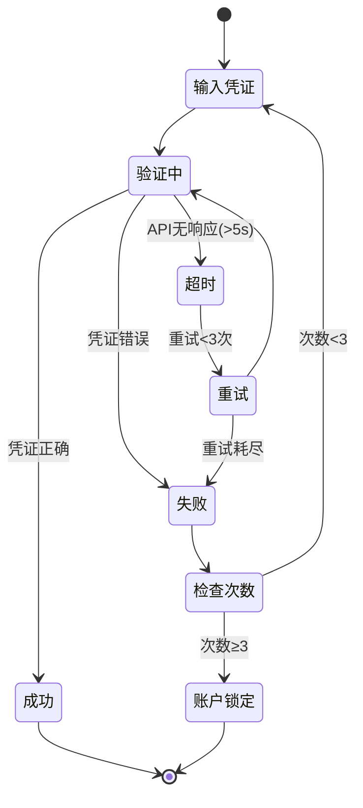

## 🎯 目标

消除"拍脑袋开发"，强制资产化交付。任何功能开发必须经过：  
**Spec → Code → Audit** 三阶段验证。

**核心原则：**
- ❌ 不再依赖"靠谱的人"
- ✅ 依赖"靠谱的流程"

---

## 📋 强制流程（不可跳过）

### 阶段 1: 意图锚定（PM 负责）

**负责人:** 产品经理  
**时间要求:** 2-4 小时

#### 产出物
1. **`logic_flow.mermaid`** - 业务流程图
2. **`requirements.md`** - EARS 语法需求文档

#### 验收标准
- [ ] 流程图包含至少 2 个异常分支（如"超时""数据为空"）
- [ ] 至少 3 条 EARS 句式描述（格式：When [事件], the system shall [动作]）
- [ ] 明确定义了"完成"的标准（验收条件）

#### 工具推荐
- **Mermaid Live Editor**: https://mermaid.live
- **Claude**: 用于将自然语言转换为 EARS 语法

#### 示例：EARS 语法需求
```markdown
# 用户登录功能需求

## EARS 句式
1. When 用户输入正确的用户名和密码, the system shall 返回 JWT Token 并跳转到首页
2. When 用户输入错误密码超过 3 次, the system shall 锁定账户 30 分钟
3. When 外部认证服务超时（>5秒）, the system shall 返回友好提示并记录错误日志
```

#### 示例：Mermaid 流程图


---

### 阶段 2: 规格生成（AI Skill 负责）

**负责人:** @spec-architect Skill  
**时间要求:** 5-10 分钟（自动化）

#### 触发指令
```bash
# 在 Claude Code 中执行
@spec-architect 根据 requirements.md 生成规格文档
```

或在对话中：
```
我需要为"用户登录"功能生成规格文档。

需求如下：
[粘贴 requirements.md 内容]
```

#### 产出物
1. **`CLAUDE.md`** - 项目宪法（Tech Stack + NEVER Rules）
2. **`schemas/data_contract.py`** - 数据契约（Pydantic 模型）
3. **`tests/behavior.feature`** - 测试用例（Gherkin 语法）

#### PM 审核检查项
- [ ] `data_contract.py` 的字段定义是否符合业务逻辑？
- [ ] `behavior.feature` 是否覆盖了所有边界情况？
- [ ] `CLAUDE.md` 的 NEVER Rules 是否与项目标准一致？

#### ⚠️ 红线规则
**如果 Spec 未通过 PM 审核，工程师不得开始写代码。**

违规后果：PR 被关闭，重新走流程。

---

### 阶段 3: 代码实现（工程师 + Trae 负责）

**负责人:** 技术团队 / Trae  
**时间要求:** 根据复杂度（1-5 天）

#### 指令模板（喂给 Trae）
```bash
基于以下规格实现功能：

1. 严格遵守 CLAUDE.md 的 Tech Stack 和 NEVER Rules
2. 代码必须匹配 schemas/data_contract.py 的类型定义
3. 必须通过 tests/behavior.feature 的所有测试用例

规格文件路径：
- ./CLAUDE.md
- ./schemas/data_contract.py
- ./tests/behavior.feature

请开始实现 [功能名称]。
```

#### 指令模板（给工程师）
```markdown
## 开发任务单

**功能名称:** [功能名称]  
**优先级:** P0 / P1 / P2  
**预计工时:** X 天

### 必读文档
- 项目宪法: `CLAUDE.md`
- 数据契约: `schemas/data_contract.py`
- 测试用例: `tests/behavior.feature`

### 验收标准
- [ ] 所有 Gherkin 测试通过（`pytest --gherkin`）
- [ ] 代码通过 `mypy`/`eslint` 静态检查
- [ ] 代码覆盖率 ≥ 80%

### 提交要求
- Commit 格式: `feat(模块名): 简短描述`
- 必须附带测试用例
- 必须通过 @nova-judge 审计（评分 ≥ 80）
```

#### 验收标准
- [ ] 所有 Gherkin 测试通过
- [ ] 静态类型检查通过（`mypy` / `eslint`）
- [ ] 代码覆盖率 ≥ 80%（核心逻辑必须覆盖）

---

### 阶段 4: 逻辑审计（AI Skill 负责）

**负责人:** @nova-judge Skill  
**时间要求:** 2-5 分钟（自动化）

#### 触发指令
```bash
# 在代码提交前执行
@nova-judge 审计 src/ 目录下的所有代码
```

或在对话中：
```
请审计以下代码文件：
- src/auth/login.py
- src/auth/validators.py

检查：幻觉风险、死循环、Token 成本、类型安全、安全漏洞
```

#### 产出物
- **`audit_report.md`** - 审计报告（包含评分、缺陷列表、修复建议）

#### 合并条件（PR Checklist）
- [ ] 综合评分 ≥ 80
- [ ] 无 RPN >50 的缺陷（P0 级别必须修复）
- [ ] 单次调用成本 <$0.1
- [ ] 所有 CRITICAL 缺陷已修复

#### ⚠️ 红线规则
**评分 <80 的代码拒绝合并到主分支。**

违规后果：代码回滚 + 扣绩效。

---

## 🚨 违规处理

| 违规行为 | 后果 | 责任人 |
|---------|------|--------|
| 跳过 Spec 直接写代码 | PR 被关闭，重新走流程 | 工程师 |
| 审计评分 <80 强行合并 | 代码回滚 + 绩效扣分 | Code Reviewer |
| 修改 NEVER Rules 规则 | 需经全员投票（2/3 通过） | PM |
| Spec 未经 PM 审核就开发 | 任务作废，重新排期 | 工程师 + PM |

---

## 📦 资产沉淀机制

### 当出现 Bug 时
1. **分析根因：** Spec 缺失？审计遗漏？代码实现错误？
2. **更新 Skill：** 修改对应 `SKILL.md` 文件，添加新规则
   - 如果是 Spec 问题 → 更新 `spec-architect/SKILL.md`
   - 如果是审计遗漏 → 更新 `nova-judge/SKILL.md`
3. **补充测试：** 将 Bug Case 补充到 `behavior.feature`
4. **团队同步：** 在周会上分享，避免重复踩坑

### 示例：Bug 导致的 Skill 更新
```markdown
# Bug 描述
用户输入超长邮箱（>256 字符）导致数据库写入失败

# 根因分析
data_contract.py 未限制邮箱字段最大长度

# Skill 更新
在 spec-architect/SKILL.md 中新增规则：
- 所有字符串字段必须设置 `max_length`
- 邮箱字段强制限制为 `max_length=256`
```

### 组织知识库
- **Spec 归档:** 所有规格文档保存到 `docs/specs/[年份]/[季度]/`
- **审计归档:** 所有审计报告保存到 `docs/audits/[年份]/[季度]/`
- **季度回顾:** 每季度统计 Bug 类型分布，优化 Skills

---

## 🎓 团队培训要求

### 新成员 Onboarding（必须完成）

#### Day 1: 理论培训（2 小时）
- [ ] 阅读本 SOP 文档并签字确认
- [ ] 理解 TDVD 协议（Test-Driven Vision Development）
- [ ] 学习 EARS 语法和 Mermaid 绘图

#### Day 2-3: 实战演练（1 天）
- [ ] 完成一次完整的 Spec → Code → Audit 流程
- [ ] 任务：实现"密码重置"功能（包含邮件发送）
- [ ] 必须通过 @nova-judge 审计（评分 ≥ 85）

#### Week 1: Code Review 考核
- [ ] 提交 3 个 PR 且全部通过审核
- [ ] 至少 1 个 PR 涉及外部 API 调用
- [ ] 至少 1 个 PR 涉及数据库事务

#### 培训资料
- [EARS 语法教程](内部链接)
- [Gherkin 最佳实践](内部链接)
- [Pydantic 完全指南](内部链接)

### 持续学习计划
- **每月技术分享会：** 1 次（轮流主讲）
- **季度 SOP 回顾：** 更新流程、优化 Skills
- **事故复盘：** Bug 导致的线上事故必须写 Post-Mortem

---

## 🔧 工具配置指南

### 环境准备（所有成员必装）

#### 1. Claude Code / Trae
```bash
# Claude Code 安装
brew install claude-code

# 验证 Skills 是否加载
claude skills list
# 应显示：spec-architect, nova-judge
```

#### 2. Pre-commit Hooks（强制代码检查）
```bash
# 安装 pre-commit
pip install pre-commit

# 配置 .pre-commit-config.yaml
cat > .pre-commit-config.yaml << 'EOF'
repos:
  - repo: https://github.com/psf/black
    rev: 23.7.0
    hooks:
      - id: black
  - repo: https://github.com/pre-commit/mirrors-mypy
    rev: v1.5.1
    hooks:
      - id: mypy
        args: [--strict]
EOF

# 安装 hooks
pre-commit install
```

#### 3. IDE 配置

**VSCode（推荐）**
```json
// .vscode/settings.json
{
  "python.linting.mypyEnabled": true,
  "python.formatting.provider": "black",
  "editor.formatOnSave": true,
  "python.linting.pylintEnabled": false,
  "[python]": {
    "editor.codeActionsOnSave": {
      "source.organizeImports": true
    }
  }
}
```

**PyCharm**
- 启用 Pydantic 插件
- 配置 Black 为默认格式化工具
- 启用 Mypy 实时检查

---

## 📊 效率指标（KPI）

### 团队级指标
- **Spec 通过率:** ≥ 95%（首次提交即通过 PM 审核）
- **审计通过率:** ≥ 90%（首次审计评分 ≥ 80）
- **Bug 逃逸率:** ≤ 5%（上线后发现的 Bug 数 / 总功能数）
- **返工率:** ≤ 10%（因 Spec 问题导致的重写）

### 个人级指标
- **Spec 质量分:** 平均 ≥ 90（PM 评分）
- **审计评分:** 平均 ≥ 85（@nova-judge 评分）
- **代码覆盖率:** ≥ 80%
- **PR 合并时间:** ≤ 2 天（从提交到合并）

### 月度回顾（每月 1 号）
- 统计上月各项指标
- 分析低分 PR 的共性问题
- 更新 Skills 或培训材料

---

## ❓ 常见问题 FAQ

### Q1: 如果 Spec 生成后需求变了怎么办？
**A:** 重新走阶段 1 和阶段 2。不允许"边写代码边改需求"。

### Q2: 审计评分 79 分，差 1 分能否通融？
**A:** 不能。80 分是硬性红线。修复缺陷后重新审计。

### Q3: 紧急 Bug 修复是否也要走完整流程？
**A:** 是。但可以简化 Spec（只需 EARS 句式，不需 Mermaid 图）。

### Q4: Trae 不支持 Skills 怎么办？
**A:** 将 `SKILL.md` 的内容作为 System Prompt 手动导入到 Trae。

### Q5: 如何判断某个功能是否需要生成 Spec？
**A:** 所有涉及以下情况的功能都需要：
- 修改数据库结构
- 新增外部 API 调用
- 影响核心业务流程
- 预计开发时间 > 1 天

### Q6: PM 不懂技术，如何审核 data_contract.py？
**A:** PM 只需检查：
1. 字段名是否符合业务术语
2. 枚举值是否完整（如用户状态是否缺少"已封禁"）
3. 校验逻辑是否合理（如手机号格式）

---

## 📞 支持与反馈

### 遇到问题时
1. **技术问题:** 在 Slack #tech-support 频道提问
2. **流程问题:** 联系 PM（你的名字）
3. **工具问题:** 联系 Tech Lead

### SOP 改进建议
- 提交 Issue 到内部 GitLab: `sop-improvements`
- 每季度评审并投票表决

---

**最后更新:** 2026-02-09  
**版本:** v1.0.0  
**维护者:** [你的名字]
```

---

## **📌 这份 SOP 的核心价值**

1. **强制流程化：** 消除"能人依赖"，团队任何人都能按流程交付
2. **资产沉淀：** 每个 Bug 都会转化为 Skill 的优化，组织能力持续增长
3. **可度量：** 清晰的 KPI（审计评分、Bug 逃逸率），可量化团队效率
4. **自动化：** 通过 AI Skills 将 PM 工作流程代码化，可复制、可迭代

---