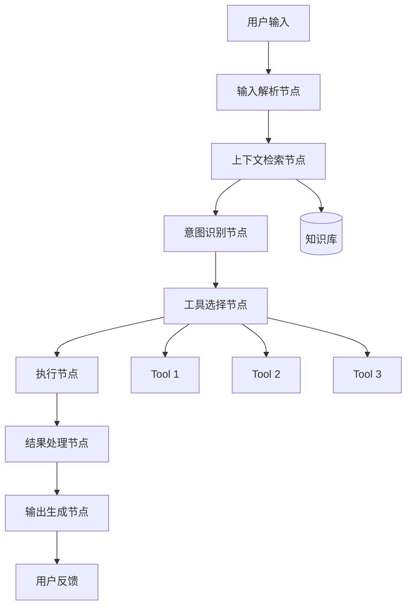
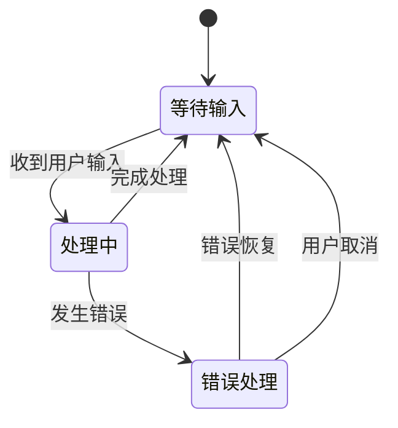
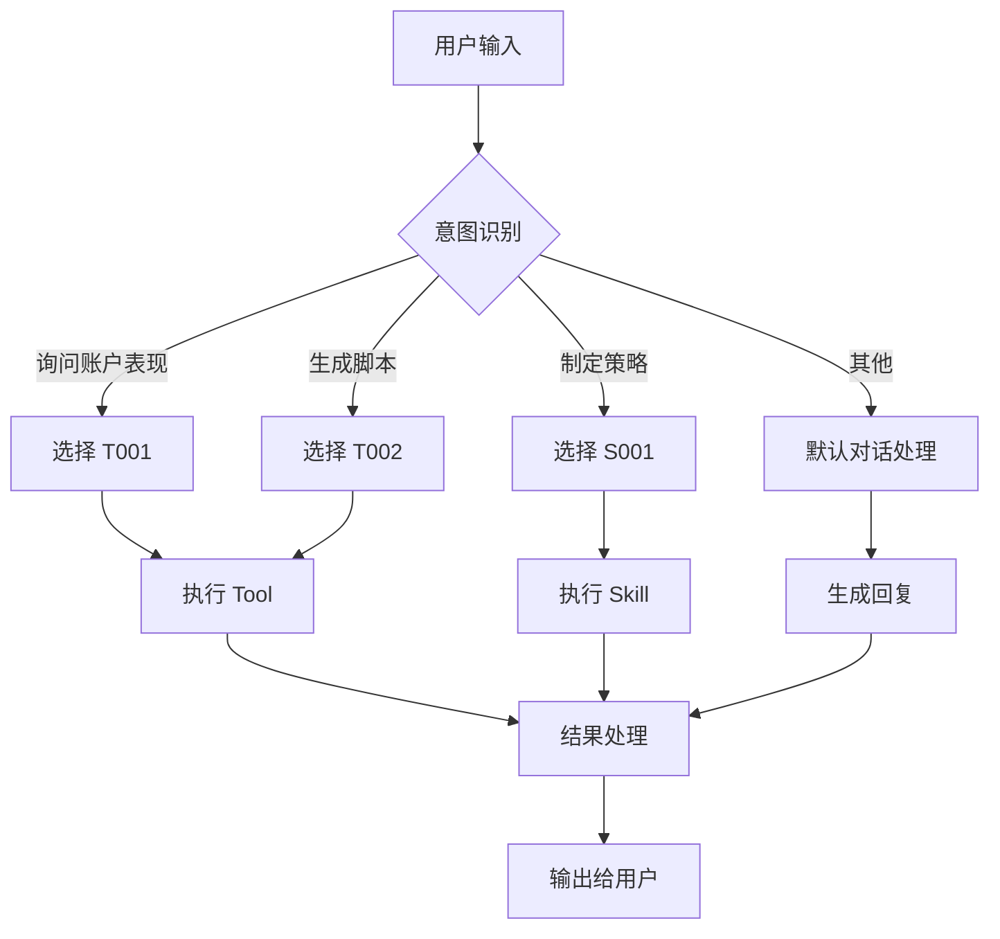
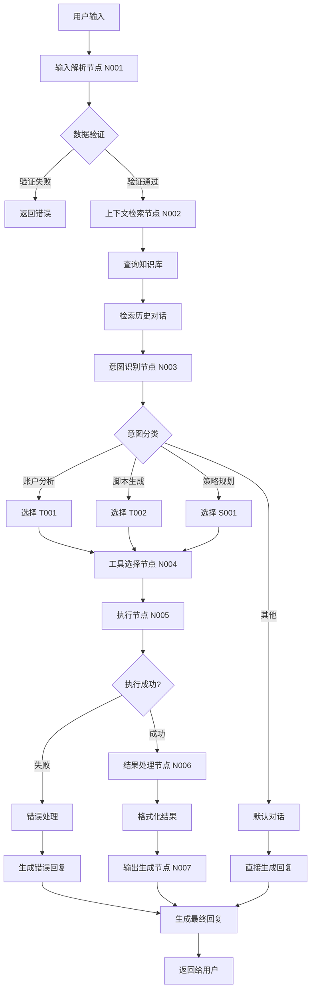

# AI Agent 产品 PRD 交付标准模板

> **文档版本**：v1.0  
> **适用范围**：AI Agent 类产品  
> **目标读者**：技术开发团队、AI工程师、后端架构师  
> **更新日期**：2026-02-04

---

## 📋 目录

1. [文档概述](#一文档概述)
2. [产品概述](#二产品概述)
3. [Agent 架构设计](#三agent-架构设计)
4. [数据输入规范](#四数据输入规范)
5. [Tools & Skills 设计](#五tools--skills-设计)
6. [用户交互流程](#六用户交互流程)
7. [Agent 内部处理逻辑](#七agent-内部处理逻辑)
8. [Prompt 工程规范](#八prompt-工程规范)
9. [输出结果规范](#九输出结果规范)
10. [技术实现要求](#十技术实现要求)
11. [测试验收标准](#十一测试验收标准)

---

## 一、文档概述

### 1.1 文档目的

本文档定义了 AI Agent 产品的 PRD 交付标准，确保产品经理能够产出**颗粒度最高、最详细**的产品需求文档，使技术团队能够：

- 清晰理解 Agent 的完整工作流程
- 准确实现每个节点的处理逻辑
- 正确配置 Tools、Skills 和 Prompt
- 准确处理输入数据和输出结果

### 1.2 文档结构说明

- **必须包含**：Agent 架构、数据流、处理逻辑、Prompt 示例
- **重点关注**：底层逻辑、技术实现细节、节点间数据传递
- **避免冗余**：不包含通用安全性、可用性描述（由技术团队负责）

---

## 二、产品/功能概述

### 2.1 产品/功能名称

**[产品名称]**

### 2.2 产品/功能定位

**[一句话描述产品定位]**

示例：
> OwlSeer AI Copilot：基于用户 TikTok 账户数据的智能内容策略助手，通过多轮对话生成可执行的内容计划和脚本。

### 2.3 核心价值

| 价值点 | 描述 |
|--------|------|
| **用户价值** | [用户能获得什么] |
| **业务价值** | [业务目标] |
| **技术价值** | [技术亮点] |

### 2.4 产品边界

**包含范围：**
- [功能范围 1]
- [功能范围 2]

**不包含范围：**
- [明确排除的功能]
- [由其他系统负责的部分]

---

## 三、Agent 架构设计

### 3.1 Agent 整体架构图



### 3.2 Agent 节点说明

| 节点ID | 节点名称 | 功能描述 | 输入 | 输出 | 依赖 |
|--------|----------|----------|------|------|------|
| N001 | 输入解析节点 | [功能描述] | [输入格式] | [输出格式] | [依赖项] |
| N002 | 上下文检索节点 | [功能描述] | [输入格式] | [输出格式] | [依赖项] |
| N003 | 意图识别节点 | [功能描述] | [输入格式] | [输出格式] | [依赖项] |
| N004 | 工具选择节点 | [功能描述] | [输入格式] | [输出格式] | [依赖项] |
| N005 | 执行节点 | [功能描述] | [输入格式] | [输出格式] | [依赖项] |
| N006 | 结果处理节点 | [功能描述] | [输入格式] | [输出格式] | [依赖项] |
| N007 | 输出生成节点 | [功能描述] | [输入格式] | [输出格式] | [依赖项] |

### 3.3 Agent 工作流程

**流程 1：标准对话流程**

```
步骤 1: 用户输入 → 输入解析节点
步骤 2: 解析结果 → 上下文检索节点
步骤 3: 检索结果 + 用户输入 → 意图识别节点
步骤 4: 意图结果 → 工具选择节点
步骤 5: 工具选择结果 → 执行节点
步骤 6: 执行结果 → 结果处理节点
步骤 7: 处理结果 → 输出生成节点
步骤 8: 输出结果 → 用户界面
```

**流程 2：[其他流程名称]**

```
[详细步骤说明]
```

### 3.4 Agent 状态机



---

## 四、数据输入规范

### 4.1 用户输入数据

#### 4.1.1 输入数据类型

| 数据类型 | 格式 | 示例 | 必填 | 说明 |
|----------|------|------|------|------|
| 用户文本 | string | "帮我生成一个关于科技的视频脚本" | ✅ | 用户直接输入的文本 |
| 用户ID | string | "user_12345" | ✅ | 用于识别用户身份 |
| 会话ID | string | "session_abc123" | ✅ | 用于维护对话上下文 |
| 账户数据 | JSON | `{"account_id": "acc_001", "platform": "tiktok"}` | ⚠️ | 条件必填（特定功能需要） |
| 历史对话 | Array | `[{"role": "user", "content": "..."}]` | ❌ | 可选，用于上下文增强 |

#### 4.1.2 输入数据结构示例

```json
{
  "user_id": "user_12345",
  "session_id": "session_abc123",
  "message": "帮我生成一个关于科技的视频脚本",
  "context": {
    "account_id": "acc_001",
    "platform": "tiktok",
    "niche": "tech_reviews"
  },
  "history": [
    {
      "role": "user",
      "content": "我想提高我的视频播放量",
      "timestamp": "2026-02-04T10:00:00Z"
    },
    {
      "role": "assistant",
      "content": "好的，我可以帮你分析账户数据...",
      "timestamp": "2026-02-04T10:00:15Z"
    }
  ],
  "metadata": {
    "language": "zh-CN",
    "timezone": "Asia/Shanghai"
  }
}
```

### 4.2 外部数据源

#### 4.2.1 数据源列表

| 数据源ID | 数据源名称 | 数据类型 | 获取方式 | 更新频率 | 说明 |
|----------|------------|----------|----------|----------|------|
| DS001 | TikTok账户数据 | JSON | API调用 | 实时 | TikTok官方API |
| DS002 | 内容库数据 | JSON | 数据库查询 | 实时 | 内部数据库 |
| DS003 | 趋势数据 | JSON | 第三方API | 每小时 | 外部数据服务 |
| DS004 | 用户偏好数据 | JSON | 数据库查询 | 实时 | 用户设置数据库 |

#### 4.2.2 数据源结构示例

**DS001 - TikTok账户数据：**

```json
{
  "account_id": "acc_001",
  "username": "techreviewsarah",
  "followers": 125000,
  "following": 500,
  "videos": [
    {
      "video_id": "vid_001",
      "title": "iPhone 15 Review",
      "views": 50000,
      "likes": 5000,
      "comments": 200,
      "shares": 300,
      "created_at": "2026-01-15T10:00:00Z"
    }
  ],
  "analytics": {
    "avg_views": 45000,
    "avg_engagement_rate": 0.12,
    "top_hashtags": ["#tech", "#iphone", "#review"]
  }
}
```

**DS002 - 内容库数据：**

```json
{
  "content_library": [
    {
      "content_id": "content_001",
      "type": "script",
      "title": "Product Review Template",
      "tags": ["review", "tech"],
      "usage_count": 15
    }
  ]
}
```

### 4.3 上下文数据

#### 4.3.1 上下文数据结构

```json
{
  "session_context": {
    "session_id": "session_abc123",
    "start_time": "2026-02-04T10:00:00Z",
    "message_count": 5,
    "current_goal": "generate_video_script"
  },
  "user_context": {
    "user_id": "user_12345",
    "preferences": {
      "content_style": "informative",
      "video_length": "60-90s",
      "target_audience": "tech_enthusiasts"
    },
    "recent_actions": [
      {
        "action": "viewed_dashboard",
        "timestamp": "2026-02-04T09:30:00Z"
      }
    ]
  },
  "agent_context": {
    "current_tools": ["script_generator", "trend_analyzer"],
    "last_output": "I've analyzed your account...",
    "conversation_stage": "clarifying_requirements"
  }
}
```

### 4.4 数据验证规则

| 字段 | 验证规则 | 错误处理 |
|------|----------|----------|
| user_id | 非空，格式：`user_[0-9a-z]+` | 返回错误码 4001 |
| message | 非空，长度 1-2000 字符 | 返回错误码 4002 |
| account_id | 如果提供，必须是有效账户ID | 返回错误码 4003 |

---

## 五、Tools & Skills 设计

### 5.1 Tools 列表

#### 5.1.1 Tool 定义规范

每个 Tool 必须包含以下信息：

- **Tool ID**：唯一标识符
- **Tool 名称**：人类可读的名称
- **功能描述**：Tool 的具体功能
- **输入参数**：参数名称、类型、是否必填、说明
- **输出格式**：返回数据的结构
- **调用条件**：何时调用此 Tool
- **错误处理**：可能的错误情况

#### 5.1.2 Tool 示例

**Tool ID: T001**

**Tool 名称：** `analyze_account_performance`

**功能描述：**
分析用户的 TikTok 账户表现数据，包括视频播放量、互动率、粉丝增长等关键指标，并识别表现趋势和潜在问题。

**输入参数：**

| 参数名 | 类型 | 必填 | 说明 | 示例值 |
|--------|------|------|------|--------|
| account_id | string | ✅ | TikTok账户ID | "acc_001" |
| time_range | string | ❌ | 时间范围（days/weeks/months） | "30days" |
| metrics | array | ❌ | 需要分析的指标列表 | ["views", "engagement_rate"] |

**输入示例：**

```json
{
  "account_id": "acc_001",
  "time_range": "30days",
  "metrics": ["views", "engagement_rate", "follower_growth"]
}
```

**输出格式：**

```json
{
  "status": "success",
  "data": {
    "account_id": "acc_001",
    "analysis_period": "2026-01-05 to 2026-02-04",
    "metrics": {
      "avg_views": 45000,
      "avg_engagement_rate": 0.12,
      "follower_growth": 5000,
      "trend": "increasing"
    },
    "insights": [
      "Your videos perform best on weekdays",
      "Tech review videos have 30% higher engagement"
    ],
    "recommendations": [
      "Post more tech review content",
      "Schedule posts for Tuesday-Thursday"
    ]
  },
  "timestamp": "2026-02-04T10:05:00Z"
}
```

**调用条件：**
- 用户询问账户表现相关问题时
- 需要生成内容策略时（作为上下文数据）
- 用户明确要求分析账户数据时

**错误处理：**

| 错误码 | 错误信息 | 处理方式 |
|--------|----------|----------|
| E_T001_001 | Account not found | 返回友好提示，建议用户检查账户ID |
| E_T001_002 | Insufficient data | 返回提示，建议扩大时间范围 |
| E_T001_003 | API rate limit | 等待后重试，最多3次 |

---

**Tool ID: T002**

**Tool 名称：** `generate_video_script`

**功能描述：**
基于用户需求、账户数据和内容模板，生成完整的视频脚本，包括开场、主体内容、结尾和行动号召。

**输入参数：**

| 参数名 | 类型 | 必填 | 说明 | 示例值 |
|--------|------|------|------|--------|
| topic | string | ✅ | 视频主题 | "iPhone 15 Pro Review" |
| style | string | ❌ | 内容风格 | "informative" |
| length | string | ❌ | 视频长度 | "60-90s" |
| account_context | object | ❌ | 账户上下文数据 | `{"niche": "tech"}` |
| template_id | string | ❌ | 使用的模板ID | "template_review_001" |

**输入示例：**

```json
{
  "topic": "iPhone 15 Pro Review",
  "style": "informative",
  "length": "60-90s",
  "account_context": {
    "niche": "tech_reviews",
    "avg_video_length": 75
  },
  "template_id": "template_review_001"
}
```

**输出格式：**

```json
{
  "status": "success",
  "data": {
    "script_id": "script_abc123",
    "title": "iPhone 15 Pro 深度评测：值得升级吗？",
    "estimated_length": "75s",
    "sections": [
      {
        "section_type": "hook",
        "content": "大家好，我是Sarah。今天来聊聊iPhone 15 Pro...",
        "duration": "5s",
        "visual_cues": ["手持iPhone特写", "产品展示"]
      },
      {
        "section_type": "main_content",
        "content": "首先看外观，钛金属材质确实比上一代轻了...",
        "duration": "50s",
        "visual_cues": ["对比画面", "细节特写"]
      },
      {
        "section_type": "cta",
        "content": "如果你觉得有用，记得点赞关注...",
        "duration": "10s",
        "visual_cues": ["关注按钮动画"]
      }
    ],
    "hashtags": ["#iPhone15Pro", "#techreview", "#apple"],
    "metadata": {
      "template_used": "template_review_001",
      "generated_at": "2026-02-04T10:10:00Z"
    }
  }
}
```

**调用条件：**
- 用户明确要求生成脚本时
- 对话流程进入"内容生成"阶段时
- 用户确认主题和需求后

**错误处理：**

| 错误码 | 错误信息 | 处理方式 |
|--------|----------|----------|
| E_T002_001 | Invalid topic | 提示用户提供更具体的主题 |
| E_T002_002 | Template not found | 使用默认模板继续生成 |
| E_T002_003 | Generation failed | 重试一次，如仍失败则返回错误 |

---

### 5.2 Skills 列表

#### 5.2.1 Skill 定义规范

Skill 是 Agent 的高级能力，通常由多个 Tools 组合实现。

**Skill ID: S001**

**Skill 名称：** `Content Strategy Planning`

**功能描述：**
为 TikTok 创作者制定完整的内容策略计划，包括内容主题、发布时间、目标受众分析等。

**组成 Tools：**
- T001: `analyze_account_performance`
- T003: `analyze_trends`（假设）
- T004: `generate_content_calendar`（假设）

**Skill 工作流程：**

```
1. 调用 T001 分析账户表现
2. 调用 T003 分析当前趋势
3. 基于分析结果，调用 T004 生成内容日历
4. 整合结果，生成策略报告
```

**输入参数：**

```json
{
  "account_id": "acc_001",
  "planning_period": "7days",
  "goals": ["increase_engagement", "grow_followers"]
}
```

**输出格式：**

```json
{
  "status": "success",
  "data": {
    "strategy_id": "strategy_xyz789",
    "planning_period": "2026-02-05 to 2026-02-11",
    "content_plan": [
      {
        "date": "2026-02-05",
        "topic": "iPhone 15 Pro Review",
        "optimal_time": "19:00",
        "target_audience": "tech_enthusiasts",
        "expected_metrics": {
          "views": 50000,
          "engagement_rate": 0.12
        }
      }
    ],
    "recommendations": [
      "Focus on tech review content",
      "Post during evening hours (7-9 PM)"
    ]
  }
}
```

---

### 5.3 Tool/Skill 选择逻辑

#### 5.3.1 选择流程图



#### 5.3.2 选择规则表

| 用户意图关键词 | 匹配规则 | 选择的 Tool/Skill | 优先级 |
|----------------|----------|-------------------|--------|
| "分析"、"表现"、"数据" | 包含关键词 | T001 | 高 |
| "生成"、"脚本"、"内容" | 包含关键词 | T002 | 高 |
| "策略"、"计划"、"规划" | 包含关键词 | S001 | 中 |
| "帮助"、"怎么"、"如何" | 包含关键词 | 默认对话 | 低 |

---

## 六、用户交互流程（可附上原型图）

### 6.1 交互原型图

#### 6.1.1 主界面布局

```
┌─────────────────────────────────────────────────────────────┐
│  [Logo] OwlSeer AI Copilot                    [设置] [帮助] │
├─────────────────────────────────────────────────────────────┤
│                                                              │
│  ┌──────────────────────────────────────────────────────┐   │
│  │  💬 对话历史区域                                      │   │
│  │                                                      │   │
│  │  [用户] 帮我生成一个关于iPhone的视频脚本              │   │
│  │                                                      │   │
│  │  [AI] 好的，我需要了解一些信息：                      │   │
│  │       1. 视频时长大概多长？                          │   │
│  │       2. 主要面向什么受众？                          │   │
│  │                                                      │   │
│  │  [用户] 60-90秒，面向科技爱好者                      │   │
│  │                                                      │   │
│  │  [AI] 正在分析你的账户数据...                        │   │
│  │       [进度条] ████████░░ 80%                        │   │
│  │                                                      │   │
│  │  [AI] ✅ 脚本已生成！                                │   │
│  │       ┌──────────────────────────────────────┐     │   │
│  │       │ 📝 iPhone 15 Pro 深度评测脚本          │     │   │
│  │       │                                         │     │   │
│  │       │ [开场] 大家好，我是Sarah...             │   │   │
│  │       │ [主体] 首先看外观...                    │   │   │
│  │       │ [结尾] 如果你觉得有用...                │   │   │
│  │       │                                         │     │   │
│  │       │ [操作] [复制] [编辑] [保存到内容库]      │     │   │
│  │       └──────────────────────────────────────┘     │   │
│  └──────────────────────────────────────────────────────┘   │
│                                                              │
│  ┌──────────────────────────────────────────────────────┐   │
│  │  [输入框] 输入你的问题或需求...        [发送] [附件] │   │
│  └──────────────────────────────────────────────────────┘   │
└─────────────────────────────────────────────────────────────┘
```

#### 6.1.2 脚本生成结果展示

```
┌─────────────────────────────────────────────────────────────┐
│  📝 生成的视频脚本                                            │
│  ──────────────────────────────────────────────────────────│
│                                                              │
│  标题：iPhone 15 Pro 深度评测：值得升级吗？                  │
│  预计时长：75秒                                              │
│  风格：信息型                                                │
│                                                              │
│  ┌──────────────────────────────────────────────────────┐  │
│  │ 📍 开场 (5秒)                                          │  │
│  │ ────────────────────────────────────────────────────  │  │
│  │ 大家好，我是Sarah。今天来聊聊iPhone 15 Pro，          │  │
│  │ 看看它到底值不值得你升级。                            │  │
│  │                                                       │  │
│  │ [视觉提示] 手持iPhone特写、产品展示                   │  │
│  └──────────────────────────────────────────────────────┘  │
│                                                              │
│  ┌──────────────────────────────────────────────────────┐  │
│  │ 📍 主体内容 (50秒)                                    │  │
│  │ ────────────────────────────────────────────────────  │  │
│  │ 首先看外观，钛金属材质确实比上一代轻了不少，          │  │
│  │ 手感更好了。屏幕方面，ProMotion 120Hz刷新率...        │  │
│  │                                                       │  │
│  │ [视觉提示] 对比画面、细节特写                         │  │
│  └──────────────────────────────────────────────────────┘  │
│                                                              │
│  ┌──────────────────────────────────────────────────────┐  │
│  │ 📍 结尾 & CTA (10秒)                                  │  │
│  │ ────────────────────────────────────────────────────  │  │
│  │ 如果你觉得有用，记得点赞关注，我们下期见！            │  │
│  │                                                       │  │
│  │ [视觉提示] 关注按钮动画                               │  │
│  └──────────────────────────────────────────────────────┘  │
│                                                              │
│  标签：#iPhone15Pro #techreview #apple                      │
│                                                              │
│  [操作按钮] [复制脚本] [编辑] [保存到内容库] [重新生成]    │
└─────────────────────────────────────────────────────────────┘
```

### 6.2 交互状态说明

| 状态 | UI表现 | 说明 |
|------|--------|------|
| **等待输入** | 输入框可用，显示占位符 | 用户可输入 |
| **处理中** | 显示"正在思考..."，禁用输入框 | Agent 处理中 |
| **工具调用中** | 显示具体工具名称和进度条 | 显示当前执行的 Tool |
| **结果展示** | 展示格式化结果，提供操作按钮 | 结果已生成 |
| **错误状态** | 显示错误提示，提供重试按钮 | 处理失败 |

### 6.3 用户操作流程

**流程 1：生成视频脚本**

```
步骤 1: 用户输入"帮我生成一个关于iPhone的视频脚本"
  ↓
步骤 2: AI 识别意图，进入"脚本生成"流程
  ↓
步骤 3: AI 询问必要信息（时长、受众等）
  ↓
步骤 4: 用户提供信息
  ↓
步骤 5: AI 调用 T001 分析账户数据（显示进度）
  ↓
步骤 6: AI 调用 T002 生成脚本（显示进度）
  ↓
步骤 7: 展示生成的脚本结果
  ↓
步骤 8: 用户可选择复制、编辑、保存等操作
```

**流程 2：[其他流程]**

```
[详细步骤说明]
```

---

## 七、Agent 内部处理逻辑

### 7.1 完整处理流程图



### 7.2 节点详细逻辑

#### 7.2.1 节点 N001：输入解析节点

**功能：** 解析和验证用户输入

**处理逻辑：**

```python
def process_input(user_input):
    # 步骤 1: 提取基础信息
    parsed_data = {
        "user_id": extract_user_id(user_input),
        "message": extract_message(user_input),
        "session_id": extract_session_id(user_input),
        "timestamp": get_current_timestamp()
    }
    
    # 步骤 2: 数据验证
    validation_result = validate_input(parsed_data)
    if not validation_result.is_valid:
        return {
            "status": "error",
            "error_code": validation_result.error_code,
            "message": validation_result.error_message
        }
    
    # 步骤 3: 文本预处理
    parsed_data["cleaned_message"] = clean_text(parsed_data["message"])
    parsed_data["tokens"] = tokenize(parsed_data["cleaned_message"])
    
    # 步骤 4: 返回解析结果
    return {
        "status": "success",
        "data": parsed_data
    }
```

**输入：**

```json
{
  "user_id": "user_12345",
  "session_id": "session_abc123",
  "message": "帮我生成一个关于iPhone的视频脚本",
  "context": {}
}
```

**输出：**

```json
{
  "status": "success",
  "data": {
    "user_id": "user_12345",
    "session_id": "session_abc123",
    "message": "帮我生成一个关于iPhone的视频脚本",
    "cleaned_message": "帮我生成一个关于iPhone的视频脚本",
    "tokens": ["帮", "我", "生成", "一个", "关于", "iPhone", "的", "视频", "脚本"],
    "timestamp": "2026-02-04T10:00:00Z"
  }
}
```

---

#### 7.2.2 节点 N002：上下文检索节点

**功能：** 检索相关上下文信息

**处理逻辑：**

```python
def retrieve_context(parsed_input):
    # 步骤 1: 检索历史对话
    history = get_conversation_history(parsed_input["session_id"])
    
    # 步骤 2: 检索知识库
    knowledge_base_results = search_knowledge_base(
        query=parsed_input["cleaned_message"],
        top_k=5
    )
    
    # 步骤 3: 检索用户账户数据（如果需要）
    account_data = None
    if needs_account_data(parsed_input["cleaned_message"]):
        account_data = get_account_data(parsed_input["user_id"])
    
    # 步骤 4: 组装上下文
    context = {
        "history": history,
        "knowledge_base": knowledge_base_results,
        "account_data": account_data
    }
    
    return {
        "status": "success",
        "data": context
    }
```

**输入：**

```json
{
  "user_id": "user_12345",
  "session_id": "session_abc123",
  "cleaned_message": "帮我生成一个关于iPhone的视频脚本"
}
```

**输出：**

```json
{
  "status": "success",
  "data": {
    "history": [
      {
        "role": "user",
        "content": "我想提高我的视频播放量",
        "timestamp": "2026-02-04T09:50:00Z"
      }
    ],
    "knowledge_base": [
      {
        "doc_id": "kb_001",
        "content": "视频脚本生成最佳实践...",
        "relevance_score": 0.85
      }
    ],
    "account_data": {
      "account_id": "acc_001",
      "niche": "tech_reviews",
      "avg_video_length": 75
    }
  }
}
```

---

#### 7.2.3 节点 N003：意图识别节点

**功能：** 识别用户意图

**处理逻辑：**

```python
def identify_intent(parsed_input, context):
    # 步骤 1: 构建意图识别 Prompt
    intent_prompt = build_intent_prompt(
        user_message=parsed_input["cleaned_message"],
        history=context["history"],
        available_intents=["analyze_account", "generate_script", "plan_strategy", "general_chat"]
    )
    
    # 步骤 2: 调用 LLM 进行意图识别
    intent_result = call_llm(intent_prompt)
    
    # 步骤 3: 解析意图结果
    identified_intent = parse_intent(intent_result)
    
    # 步骤 4: 提取关键参数
    extracted_params = extract_parameters(
        message=parsed_input["cleaned_message"],
        intent=identified_intent
    )
    
    return {
        "status": "success",
        "data": {
            "intent": identified_intent,
            "confidence": intent_result["confidence"],
            "parameters": extracted_params
        }
    }
```

**输入：**

```json
{
  "cleaned_message": "帮我生成一个关于iPhone的视频脚本",
  "context": {
    "history": [...],
    "account_data": {...}
  }
}
```

**输出：**

```json
{
  "status": "success",
  "data": {
    "intent": "generate_script",
    "confidence": 0.95,
    "parameters": {
      "topic": "iPhone",
      "content_type": "video_script",
      "urgency": "normal"
    }
  }
}
```

---

#### 7.2.4 节点 N004：工具选择节点

**功能：** 根据意图选择合适的 Tool/Skill

**处理逻辑：**

```python
def select_tool(intent_result):
    intent = intent_result["intent"]
    
    # 工具选择映射
    tool_mapping = {
        "analyze_account": {
            "tool_id": "T001",
            "tool_name": "analyze_account_performance",
            "required_params": ["account_id"]
        },
        "generate_script": {
            "tool_id": "T002",
            "tool_name": "generate_video_script",
            "required_params": ["topic"]
        },
        "plan_strategy": {
            "skill_id": "S001",
            "skill_name": "Content Strategy Planning",
            "required_params": ["account_id", "planning_period"]
        }
    }
    
    selected_tool = tool_mapping.get(intent)
    
    if not selected_tool:
        return {
            "status": "success",
            "data": {
                "tool_type": "default_chat",
                "tool_id": None
            }
        }
    
    # 检查必需参数
    missing_params = check_required_params(
        intent_result["parameters"],
        selected_tool["required_params"]
    )
    
    if missing_params:
        return {
            "status": "need_more_info",
            "data": {
                "missing_params": missing_params,
                "tool": selected_tool
            }
        }
    
    return {
        "status": "success",
        "data": {
            "tool_type": "tool" if "tool_id" in selected_tool else "skill",
            "tool_id": selected_tool.get("tool_id") or selected_tool.get("skill_id"),
            "tool_name": selected_tool["tool_name"],
            "parameters": intent_result["parameters"]
        }
    }
```

**输入：**

```json
{
  "intent": "generate_script",
  "parameters": {
    "topic": "iPhone",
    "content_type": "video_script"
  }
}
```

**输出：**

```json
{
  "status": "success",
  "data": {
    "tool_type": "tool",
    "tool_id": "T002",
    "tool_name": "generate_video_script",
    "parameters": {
      "topic": "iPhone",
      "content_type": "video_script"
    }
  }
}
```

---

#### 7.2.5 节点 N005：执行节点

**功能：** 执行选定的 Tool/Skill

**处理逻辑：**

```python
def execute_tool(tool_selection, context):
    tool_id = tool_selection["tool_id"]
    parameters = tool_selection["parameters"]
    
    # 步骤 1: 准备 Tool 输入
    tool_input = prepare_tool_input(
        tool_id=tool_id,
        parameters=parameters,
        context=context
    )
    
    # 步骤 2: 调用 Tool
    try:
        tool_result = call_tool(tool_id, tool_input)
        
        # 步骤 3: 验证 Tool 输出
        validated_result = validate_tool_output(tool_id, tool_result)
        
        return {
            "status": "success",
            "data": {
                "tool_id": tool_id,
                "execution_time": tool_result["execution_time"],
                "result": validated_result
            }
        }
    except ToolError as e:
        return {
            "status": "error",
            "error_code": e.error_code,
            "error_message": e.message,
            "data": {
                "tool_id": tool_id
            }
        }
```

**输入：**

```json
{
  "tool_id": "T002",
  "tool_name": "generate_video_script",
  "parameters": {
    "topic": "iPhone 15 Pro",
    "style": "informative",
    "length": "60-90s",
    "account_context": {
      "niche": "tech_reviews"
    }
  }
}
```

**输出：**

```json
{
  "status": "success",
  "data": {
    "tool_id": "T002",
    "execution_time": 2.5,
    "result": {
      "script_id": "script_abc123",
      "title": "iPhone 15 Pro 深度评测：值得升级吗？",
      "sections": [...],
      "hashtags": ["#iPhone15Pro", "#techreview"]
    }
  }
}
```

---

#### 7.2.6 节点 N006：结果处理节点

**功能：** 处理和格式化 Tool 执行结果

**处理逻辑：**

```python
def process_result(execution_result, context):
    tool_result = execution_result["result"]
    tool_id = execution_result["tool_id"]
    
    # 步骤 1: 根据 Tool 类型选择处理方式
    if tool_id == "T001":
        processed = format_account_analysis(tool_result)
    elif tool_id == "T002":
        processed = format_script_result(tool_result)
    elif tool_id == "S001":
        processed = format_strategy_result(tool_result)
    else:
        processed = format_default_result(tool_result)
    
    # 步骤 2: 添加元数据
    processed["metadata"] = {
        "tool_id": tool_id,
        "execution_time": execution_result["execution_time"],
        "timestamp": get_current_timestamp()
    }
    
    # 步骤 3: 添加可操作项
    processed["actions"] = get_available_actions(tool_id, processed)
    
    return {
        "status": "success",
        "data": processed
    }
```

---

#### 7.2.7 节点 N007：输出生成节点

**功能：** 生成最终的用户回复

**处理逻辑：**

```python
def generate_output(processed_result, context):
    # 步骤 1: 构建输出生成 Prompt
    output_prompt = build_output_prompt(
        processed_result=processed_result,
        context=context,
        user_message=context["user_message"]
    )
    
    # 步骤 2: 调用 LLM 生成回复
    llm_response = call_llm(output_prompt)
    
    # 步骤 3: 格式化回复
    formatted_output = format_response(
        llm_response=llm_response,
        processed_result=processed_result
    )
    
    return {
        "status": "success",
        "data": {
            "message": formatted_output["message"],
            "result_data": processed_result,
            "actions": processed_result["actions"],
            "suggestions": formatted_output["suggestions"]
        }
    }
```

---

### 7.3 数据流转示例

**完整流程数据流转：**

```
用户输入
  ↓
{
  "user_id": "user_12345",
  "message": "帮我生成一个关于iPhone的视频脚本"
}
  ↓ [N001: 输入解析]
{
  "cleaned_message": "帮我生成一个关于iPhone的视频脚本",
  "tokens": [...]
}
  ↓ [N002: 上下文检索]
{
  "history": [...],
  "account_data": {"niche": "tech_reviews"}
}
  ↓ [N003: 意图识别]
{
  "intent": "generate_script",
  "parameters": {"topic": "iPhone"}
}
  ↓ [N004: 工具选择]
{
  "tool_id": "T002",
  "parameters": {"topic": "iPhone 15 Pro"}
}
  ↓ [N005: 执行]
{
  "script_id": "script_abc123",
  "title": "iPhone 15 Pro 深度评测",
  "sections": [...]
}
  ↓ [N006: 结果处理]
{
  "formatted_result": {...},
  "actions": ["copy", "edit", "save"]
}
  ↓ [N007: 输出生成]
{
  "message": "✅ 脚本已生成！",
  "result_data": {...}
}
  ↓
返回给用户
```

---

## 八、Prompt 工程规范

### 8.1 Prompt 设计原则

1. **明确性**：每个 Prompt 必须清晰说明期望的输出
2. **上下文完整**：包含必要的上下文信息
3. **示例驱动**：提供示例帮助模型理解
4. **结构化输出**：要求 JSON 格式输出，便于解析

### 8.2 各节点 Prompt 示例

#### 8.2.1 节点 N003：意图识别 Prompt

```python
INTENT_IDENTIFICATION_PROMPT = """
你是一个意图识别助手。根据用户输入和历史对话，识别用户的真实意图。

可用意图列表：
1. analyze_account - 用户想分析账户表现数据
2. generate_script - 用户想生成视频脚本
3. plan_strategy - 用户想制定内容策略
4. general_chat - 一般性对话

历史对话：
{history}

用户当前输入：{user_message}

请分析用户意图，并返回 JSON 格式：
{{
    "intent": "意图名称",
    "confidence": 0.0-1.0的置信度,
    "parameters": {{
        "topic": "提取的主题（如果有）",
        "content_type": "内容类型（如果有）",
        "urgency": "紧急程度（normal/urgent）"
    }},
    "reasoning": "识别理由"
}}

示例：
用户输入："帮我分析一下我的账户数据"
输出：
{{
    "intent": "analyze_account",
    "confidence": 0.95,
    "parameters": {{
        "topic": null,
        "content_type": null,
        "urgency": "normal"
    }},
    "reasoning": "用户明确要求分析账户数据"
}}
"""
```

#### 8.2.2 节点 N007：输出生成 Prompt

```python
OUTPUT_GENERATION_PROMPT = """
你是一个友好的 AI 助手，帮助 TikTok 创作者生成内容。

用户请求：{user_message}

Tool 执行结果：
{tool_result}

请基于 Tool 执行结果，生成友好的用户回复。

要求：
1. 回复要自然、友好、有帮助
2. 突出关键信息
3. 提供下一步建议（如果有）
4. 使用适当的 emoji 增强可读性

输出格式（JSON）：
{{
    "message": "主要回复内容",
    "suggestions": ["建议1", "建议2"],
    "tone": "friendly"
}}

示例：
Tool 结果：生成了一个关于 iPhone 的脚本
输出：
{{
    "message": "✅ 脚本已生成！我为你创建了一个关于 iPhone 15 Pro 的深度评测脚本，预计时长75秒。脚本包含开场、主体内容和结尾，你可以直接使用或根据需要进行调整。",
    "suggestions": [
        "你可以复制脚本到剪贴板",
        "或者保存到内容库方便以后使用",
        "需要我帮你调整脚本的某个部分吗？"
    ],
    "tone": "friendly"
}}
"""
```

#### 8.2.3 Tool T002：脚本生成 Prompt（内部）

```python
SCRIPT_GENERATION_PROMPT = """
你是一个专业的视频脚本生成器，专门为 TikTok 创作者生成高质量的视频脚本。

用户需求：
- 主题：{topic}
- 风格：{style}
- 视频长度：{length}
- 账户定位：{niche}

账户上下文：
{account_context}

内容模板：
{template}

请生成一个完整的视频脚本，包含：
1. 吸引人的开场（Hook）
2. 有价值的主体内容
3. 明确的行动号召（CTA）

输出格式（JSON）：
{{
    "title": "脚本标题",
    "estimated_length": "预计时长（秒）",
    "sections": [
        {{
            "section_type": "hook/main_content/cta",
            "content": "脚本内容",
            "duration": "时长（秒）",
            "visual_cues": ["视觉提示1", "视觉提示2"]
        }}
    ],
    "hashtags": ["标签1", "标签2", "标签3"]
}}

要求：
- 内容要有价值，符合目标受众
- 语言自然，适合口语表达
- 视觉提示要具体可执行
- 标签要相关且热门
"""
```

### 8.3 Prompt 变量说明

| 变量名 | 说明 | 来源 | 示例值 |
|--------|------|------|--------|
| `{user_message}` | 用户输入消息 | 节点 N001 | "帮我生成脚本" |
| `{history}` | 历史对话 | 节点 N002 | `[{"role": "user", ...}]` |
| `{account_data}` | 账户数据 | 节点 N002 | `{"niche": "tech"}` |
| `{intent}` | 识别的意图 | 节点 N003 | "generate_script" |
| `{tool_result}` | Tool 执行结果 | 节点 N005 | `{"script_id": "..."}` |
| `{context}` | 完整上下文 | 多个节点 | `{...}` |

### 8.4 Prompt 版本管理

| Prompt ID | Prompt 名称 | 版本 | 最后更新 | 说明 |
|-----------|-------------|------|----------|------|
| P_N003_001 | 意图识别 | v1.2 | 2026-02-01 | 增加了参数提取 |
| P_N007_001 | 输出生成 | v1.0 | 2026-01-15 | 初始版本 |
| P_T002_001 | 脚本生成 | v1.1 | 2026-01-20 | 优化了视觉提示 |

---

## 九、输出结果规范

### 9.1 标准输出格式

所有 Agent 输出必须遵循以下 JSON 结构：

```json
{
  "status": "success|error|need_more_info",
  "message": "用户可见的消息",
  "data": {
    // 具体数据内容
  },
  "metadata": {
    "session_id": "session_abc123",
    "timestamp": "2026-02-04T10:15:00Z",
    "execution_time": 2.5,
    "tool_used": "T002"
  },
  "actions": [
    {
      "action_id": "copy_script",
      "label": "复制脚本",
      "type": "button"
    }
  ],
  "suggestions": [
    "你可以保存脚本到内容库",
    "需要我帮你调整脚本吗？"
  ]
}
```

### 9.2 各场景输出示例

#### 9.2.1 脚本生成成功

```json
{
  "status": "success",
  "message": "✅ 脚本已生成！我为你创建了一个关于 iPhone 15 Pro 的深度评测脚本。",
  "data": {
    "script_id": "script_abc123",
    "title": "iPhone 15 Pro 深度评测：值得升级吗？",
    "estimated_length": "75秒",
    "sections": [
      {
        "section_type": "hook",
        "content": "大家好，我是Sarah。今天来聊聊iPhone 15 Pro，看看它到底值不值得你升级。",
        "duration": "5s",
        "visual_cues": ["手持iPhone特写", "产品展示"]
      },
      {
        "section_type": "main_content",
        "content": "首先看外观，钛金属材质确实比上一代轻了不少，手感更好了。屏幕方面，ProMotion 120Hz刷新率用起来确实流畅...",
        "duration": "50s",
        "visual_cues": ["对比画面", "细节特写"]
      },
      {
        "section_type": "cta",
        "content": "如果你觉得有用，记得点赞关注，我们下期见！",
        "duration": "10s",
        "visual_cues": ["关注按钮动画"]
      }
    ],
    "hashtags": ["#iPhone15Pro", "#techreview", "#apple"]
  },
  "metadata": {
    "session_id": "session_abc123",
    "timestamp": "2026-02-04T10:15:00Z",
    "execution_time": 2.5,
    "tool_used": "T002"
  },
  "actions": [
    {
      "action_id": "copy_script",
      "label": "复制脚本",
      "type": "button",
      "icon": "copy"
    },
    {
      "action_id": "edit_script",
      "label": "编辑",
      "type": "button",
      "icon": "edit"
    },
    {
      "action_id": "save_to_library",
      "label": "保存到内容库",
      "type": "button",
      "icon": "save"
    },
    {
      "action_id": "regenerate",
      "label": "重新生成",
      "type": "button",
      "icon": "refresh"
    }
  ],
  "suggestions": [
    "你可以复制脚本直接使用",
    "或者保存到内容库方便以后参考",
    "需要我帮你调整脚本的某个部分吗？"
  ]
}
```

#### 9.2.2 需要更多信息

```json
{
  "status": "need_more_info",
  "message": "好的，我可以帮你生成脚本！为了生成最适合你的脚本，我需要了解一些信息：",
  "data": {
    "missing_params": [
      {
        "param_name": "video_length",
        "question": "视频时长大概多长？",
        "options": ["30-60秒", "60-90秒", "90秒以上"],
        "required": true
      },
      {
        "param_name": "target_audience",
        "question": "主要面向什么受众？",
        "options": ["科技爱好者", "普通消费者", "专业人士"],
        "required": true
      }
    ]
  },
  "metadata": {
    "session_id": "session_abc123",
    "timestamp": "2026-02-04T10:10:00Z"
  },
  "actions": [
    {
      "action_id": "skip_questions",
      "label": "使用默认设置",
      "type": "button"
    }
  ]
}
```

#### 9.2.3 错误情况

```json
{
  "status": "error",
  "message": "抱歉，生成脚本时遇到了问题。请稍后重试。",
  "error": {
    "error_code": "E_T002_003",
    "error_message": "Generation failed after retry",
    "details": "模型调用超时"
  },
  "metadata": {
    "session_id": "session_abc123",
    "timestamp": "2026-02-04T10:12:00Z",
    "tool_used": "T002"
  },
  "actions": [
    {
      "action_id": "retry",
      "label": "重试",
      "type": "button"
    },
    {
      "action_id": "contact_support",
      "label": "联系支持",
      "type": "button"
    }
  ]
}
```

### 9.3 输出数据验证

| 字段 | 验证规则 | 错误处理 |
|------|----------|----------|
| `status` | 必须是 "success"、"error"、"need_more_info" 之一 | 返回默认错误 |
| `message` | 非空字符串，长度 1-500 字符 | 使用默认消息 |
| `data` | 如果 status 为 "success"，必须存在 | 返回空对象 |
| `metadata.timestamp` | 必须是有效的 ISO 8601 格式 | 使用当前时间 |

---

## 十、技术实现要求

### 10.1 技术栈要求

| 组件 | 技术选型 | 版本要求 | 说明 |
|------|----------|----------|------|
| **LLM** | OpenAI GPT-4 / Claude 3 | 最新稳定版 | 核心推理引擎 |
| **向量数据库** | Pinecone / Weaviate | 最新版 | 知识库检索 |
| **消息队列** | RabbitMQ / Redis | 最新版 | 异步任务处理 |
| **API 框架** | FastAPI / Flask | 最新版 | 后端 API |
| **数据库** | PostgreSQL / MongoDB | 最新版 | 数据存储 |

### 10.2 性能要求

| 指标 | 目标值 | 说明 |
|------|--------|------|
| **响应时间（P95）** | < 3秒 | 从用户输入到返回结果 |
| **Tool 执行时间** | < 5秒 | 单个 Tool 执行时间 |
| **并发处理能力** | 100 req/s | 每秒处理的请求数 |
| **可用性** | 99.9% | 系统可用时间比例 |

### 10.3 错误处理要求

| 错误类型 | 处理方式 | 用户提示 |
|----------|----------|----------|
| **LLM 调用失败** | 重试 2 次，如仍失败则返回错误 | "抱歉，处理遇到问题，请稍后重试" |
| **Tool 执行超时** | 取消任务，返回超时错误 | "操作超时，请重试" |
| **数据验证失败** | 立即返回验证错误 | "输入数据格式不正确，请检查" |
| **系统错误** | 记录日志，返回通用错误 | "系统暂时不可用，请稍后再试" |

### 10.4 日志要求

**必须记录的日志：**

1. **用户请求日志**
   ```json
   {
     "level": "info",
     "type": "user_request",
     "user_id": "user_12345",
     "session_id": "session_abc123",
     "message": "用户输入内容",
     "timestamp": "2026-02-04T10:00:00Z"
   }
   ```

2. **Tool 调用日志**
   ```json
   {
     "level": "info",
     "type": "tool_call",
     "tool_id": "T002",
     "input": {...},
     "output": {...},
     "execution_time": 2.5,
     "timestamp": "2026-02-04T10:05:00Z"
   }
   ```

3. **错误日志**
   ```json
   {
     "level": "error",
     "type": "error",
     "error_code": "E_T002_003",
     "error_message": "详细错误信息",
     "stack_trace": "...",
     "timestamp": "2026-02-04T10:10:00Z"
   }
   ```

---

## 十一、测试验收标准

### 11.1 功能测试用例

#### 测试用例 TC001：生成视频脚本

**前置条件：**
- 用户已登录
- 账户数据已连接

**测试步骤：**
1. 用户输入："帮我生成一个关于iPhone的视频脚本"
2. AI 询问必要信息
3. 用户提供：时长 60-90秒，受众 科技爱好者
4. 等待 AI 生成脚本

**预期结果：**
- AI 成功生成脚本
- 脚本包含开场、主体、结尾
- 脚本时长符合要求
- 提供复制、编辑等操作按钮

**验收标准：**
- ✅ 脚本生成成功
- ✅ 脚本结构完整
- ✅ 脚本内容相关
- ✅ 操作按钮可用

---

#### 测试用例 TC002：账户数据分析

**前置条件：**
- 用户已登录
- 账户有足够的历史数据

**测试步骤：**
1. 用户输入："分析一下我的账户表现"
2. 等待 AI 分析

**预期结果：**
- AI 调用 T001 Tool
- 返回账户分析结果
- 包含关键指标和洞察

**验收标准：**
- ✅ Tool 调用成功
- ✅ 返回数据完整
- ✅ 分析结果准确

---

### 11.2 性能测试用例

| 测试场景 | 并发数 | 预期响应时间 | 通过标准 |
|----------|--------|--------------|----------|
| 脚本生成 | 10 | < 3秒 | P95 < 3秒 |
| 账户分析 | 20 | < 2秒 | P95 < 2秒 |
| 混合场景 | 50 | < 5秒 | P95 < 5秒 |

### 11.3 错误处理测试

| 测试场景 | 预期行为 | 验收标准 |
|----------|----------|----------|
| LLM 调用失败 | 重试 2 次后返回错误 | ✅ 重试机制正常 |
| Tool 超时 | 返回超时错误 | ✅ 错误提示友好 |
| 无效输入 | 返回验证错误 | ✅ 错误信息明确 |

---

## 附录 A：术语表

| 术语 | 英文 | 说明 |
|------|------|------|
| Agent | Agent | AI 智能体，能够自主执行任务的 AI 系统 |
| Tool | Tool | Agent 可以调用的外部工具或函数 |
| Skill | Skill | 由多个 Tools 组合的高级能力 |
| Prompt | Prompt | 输入给 LLM 的提示文本 |
| 节点 | Node | Agent 处理流程中的一个处理单元 |
| 上下文 | Context | Agent 处理时使用的背景信息 |

---

## 附录 B：PRD 检查清单

在提交 PRD 前，请确认：

- [ ] **Agent 架构**：是否清晰描述了所有节点和处理流程？
- [ ] **数据输入**：是否详细说明了所有输入数据的格式和来源？
- [ ] **Tools/Skills**：是否完整定义了每个 Tool/Skill 的输入输出？
- [ ] **用户交互**：是否提供了原型图和交互流程说明？
- [ ] **处理逻辑**：是否详细描述了每个节点的处理逻辑？
- [ ] **Prompt 示例**：是否提供了所有关键节点的 Prompt 示例？
- [ ] **输出格式**：是否明确了输出数据的结构和格式？
- [ ] **测试用例**：是否提供了足够的测试用例和验收标准？

---

**文档结束**

> 本文档是 PRD 交付标准模板，产品经理应根据具体产品需求填写详细内容。  
> 如有疑问，请联系产品总监或技术负责人。
