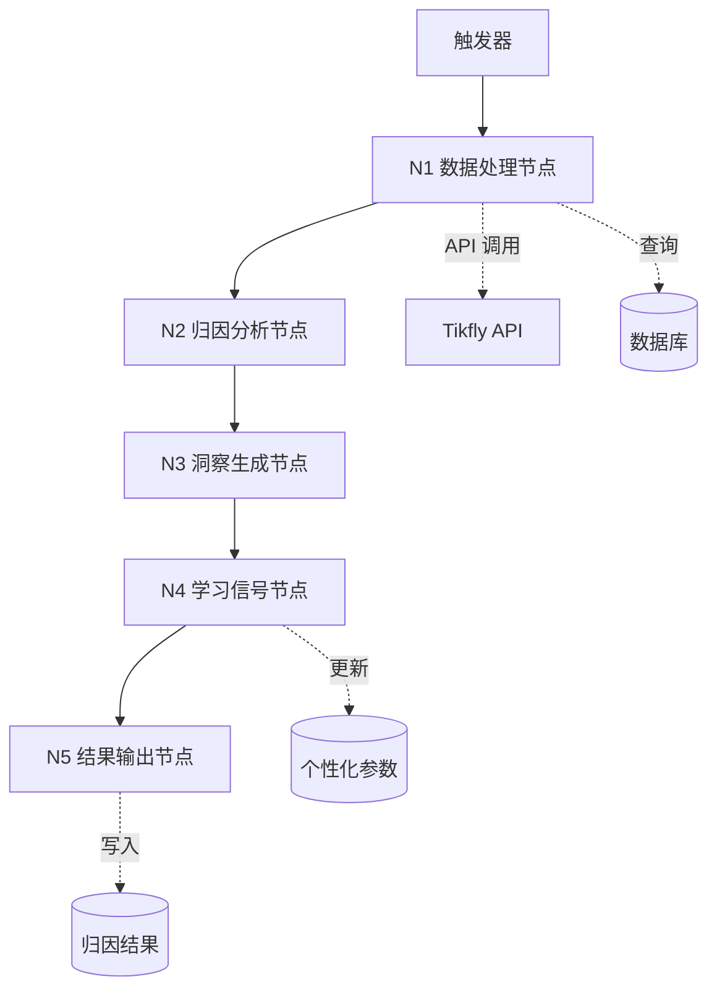
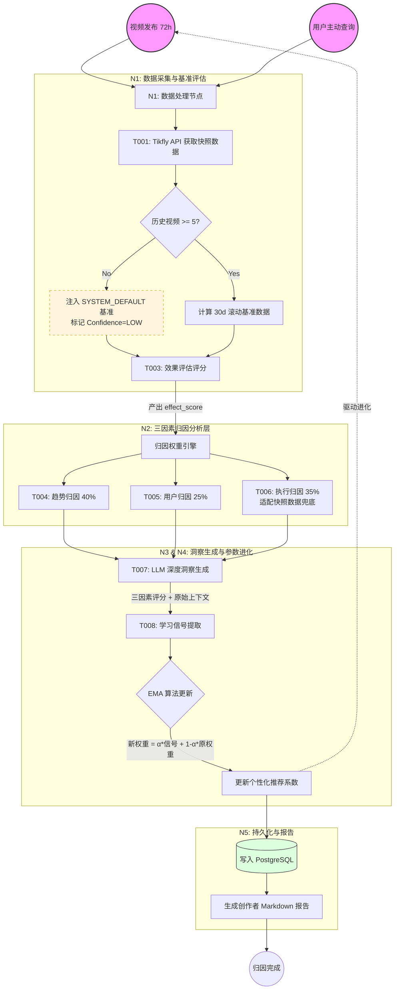
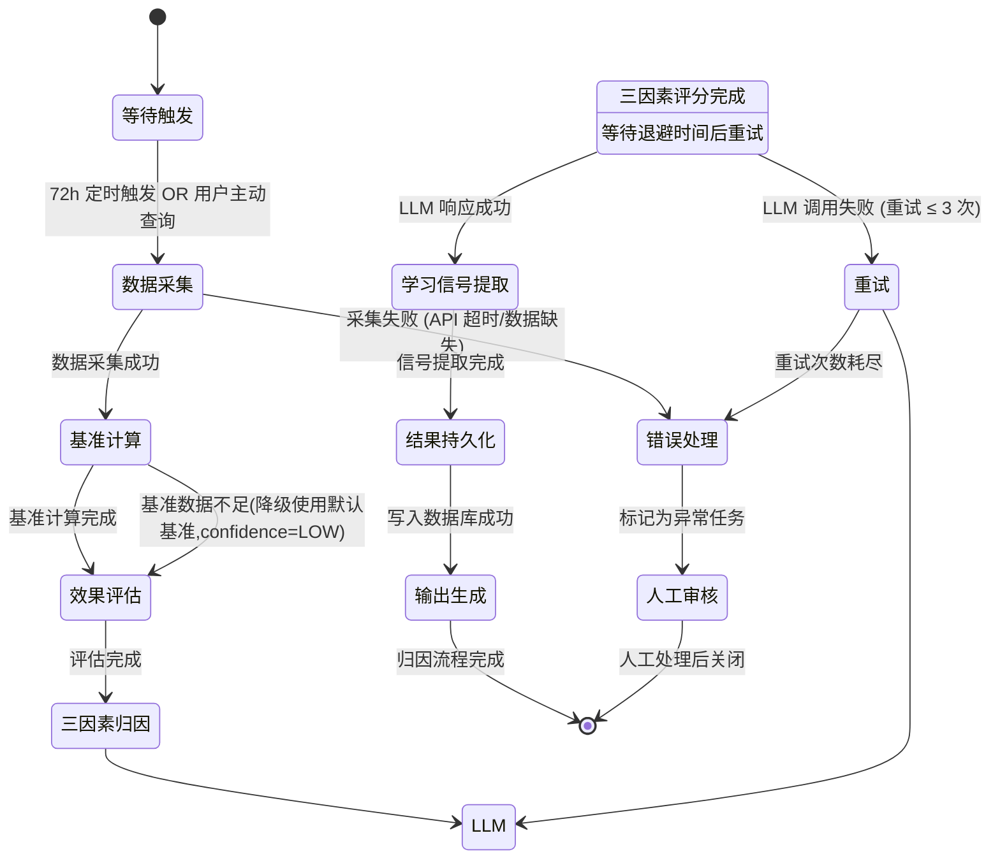

# **效果归因 Agent - 产品需求文档 (PRD)**

> **文档版本**：v2.0 (改进版)
> **适用范围**：TikTok AI 运营系统 - 效果归因模块
> **目标读者**：后端开发团队、AI 工程师、数据工程师
> **更新日期**：2026-02-07
> **文档作者**：Arnold

## 📝 版本更新说明 (v2.0)

基于 v1.0 实施结果的评估反馈，本版本进行了以下关键改进：

1. **✅ 增加功能优先级定义**
   - 新增第 2.5 节：功能优先级与 MVP 定义
   - 明确 P0/P1/P2 优先级，定义 MVP 范围
   - 提供分阶段实施计划

2. **✅ 简化架构设计**
   - Agent 节点从 10 个简化为 5 个（减少 50%）
   - Tools 从 8 个简化为 5 个（减少 37.5%）
   - 数据库表保持 4 个（已优化）

3. **✅ 明确 MVP 范围**
   - 定义 MVP 必须实现的功能（P0）
   - 区分重要但非必须的功能（P1）
   - 标注可选功能（P2）

**改进目标**：
- 降低实施复杂度，缩短开发周期
- 提高实施可控性，确保核心功能优先交付
- 保持技术质量，不降低系统可扩展性

---

## 📋 目录

1. [文档概述](#一文档概述)
2. [产品概述](#二产品概述)
   - **2.5 功能优先级与 MVP 定义** ⭐ 新增
3. [Agent 架构设计](#三agent-架构设计) ⭐ 简化
4. [数据输入规范](#四数据输入规范)
5. [Tools & Skills 设计](#五tools--skills-设计) ⭐ 简化
6. [Agent 内部处理逻辑](#六agent-内部处理逻辑)
7. [Prompt 工程规范](#七prompt-工程规范)
8. [输出结果规范](#八输出结果规范)
9. [技术实现要求](#九技术实现要求)
10. [测试验收标准](#十测试验收标准)

---

## 一、文档概述

### 1.1 文档目的

本文档详细定义**效果归因 Agent** 的产品需求规格，确保技术团队能够：

1. **准确理解业务逻辑**：三层归因分析框架（趋势/用户/执行因素）的计算规则
2. **正确实现数据流转**：从 Tikfly API 抓取到归因结果输出的完整数据链路
3. **精确配置 LLM Prompt**：归因分析的 System Prompt 与 User Prompt 模板
4. **清晰掌握接口规范**：数据库表结构、API 端点、错误处理机制

### 1.2 文档结构说明

- **必须包含**：Agent 节点逻辑、数据结构定义、Prompt 完整示例、数据库 Schema
- **重点关注**：归因算法实现细节、学习信号生成规则、Tikfly API 集成方案
- **不包含**：通用的系统监控、日志规范（由技术团队基础设施负责）

### 1.3 关键术语定义

| 术语 | 定义 |
|------|------|
| **归因分析** | 将内容效果分解为趋势/用户/执行三因素，量化各因素贡献度的过程 |
| **相对评估** | 基于用户历史基准（而非绝对阈值）进行效果评分的方法 |
| **学习信号** | 归因结果产生的用于优化推荐系统的参数调整指令 |
| **执行到位度** | 实际执行与推荐策略的符合程度（0-100 分） |
| **效果等级** | 综合评分映射的五级分类：viral/excellent/good/average/poor |

---

## 二、产品概述

### 2.1 产品/功能名称

**效果归因 Agent (Attribution Agent)**

### 2.2 产品定位

> **TikTok AI 运营系统的"智慧大脑"**，通过科学的三层归因分析（趋势因素 40% + 用户因素 25% + 执行因素 35%），将内容效果转化为可学习知识，驱动推荐系统的持续进化。

### 2.3 核心价值

| 价值点 | 描述 |
|--------|------|
| **用户价值** | 创作者获得精准的效果解读和可操作改进建议，内容效果提升 15-30% |
| **业务价值** | 构建独有的"趋势+用户+执行=效果"知识图谱，形成核心竞争壁垒 |
| **技术价值** | 实现推荐算法自我优化，归因准确率 > 85%，学习反馈有效性 > 90% |

### 2.4 产品边界

**包含范围：**
- 72 小时效果数据归因分析
- 三因素定量评分计算
- LLM 驱动的洞察生成
- 学习信号自动提取与注入
- 异常检测与人工审核触发

**不包含范围：**
- 实时流量预警（由监控系统负责）
- 内容推荐生成（由推荐 Agent 负责）
- 直接的数据可视化（由前端 BI 模块负责）
- Tikfly API 底层实现（使用第三方服务）

---

### 2.5 功能优先级与 MVP 定义 ⭐ 新增

#### 2.5.1 优先级定义标准

| 优先级 | 标识 | 定义 | 实施要求 |
|--------|------|------|----------|
| **P0** | 🔴 必须实现 | MVP 核心功能，缺失则系统无法运行 | Phase 1 必须完成 |
| **P1** | 🟡 重要功能 | 提升用户体验和系统完整性的功能 | Phase 2 完成 |
| **P2** | 🟢 可选功能 | 优化性能和扩展能力的功能 | Phase 3 或后续迭代 |

#### 2.5.2 MVP 范围定义 (Phase 1)

**目标**：实现核心归因分析能力，验证业务价值

**P0 功能清单** 🔴：

| 功能模块 | 功能描述 | 验收标准 |
|---------|---------|---------|
| **核心算法** | 三因素归因算法（40/25/35 权重） | 权重守恒，评分有界 |
| **相对评分** | Z-score 标准化评分模型 | 零值保护，边界验证 |
| **API 客户端** | Tikfly API 调用（视频详情） | 重试机制，限流控制 |
| **LLM 集成** | KIMI API 调用（洞察生成） | JSON 输出，Schema 验证 |
| **学习信号** | EMA 更新算法 | 偏好系数更新 |
| **API 端点** | POST /analyze, GET /{id} | 请求验证，错误处理 |
| **单元测试** | 核心模块测试覆盖 > 90% | 24+ 测试用例通过 |

**MVP 不包含** ❌：
- 数据库持久化（使用内存存储）
- Redis 缓存
- Celery 异步任务
- 批量归因分析
- 完整的 10 个 Agent 节点
- 集成测试和端到端测试

**MVP 交付标准**：
- ✅ 核心归因算法可运行
- ✅ API 可接受请求并返回结果
- ✅ 单元测试 100% 通过
- ✅ 代码质量达到生产级别

---

#### 2.5.3 Phase 2 功能规划 (P1)

**目标**：完善系统功能，实现生产就绪

**P1 功能清单** 🟡：

| 功能模块 | 功能描述 | 依赖 |
|---------|---------|------|
| **数据库集成** | PostgreSQL + SQLAlchemy | MVP 完成 |
| **缓存层** | Redis 缓存（TTL=24h） | 数据库集成 |
| **完整归因流程** | 5 个 Agent 节点集成 | 数据库集成 |
| **基准计算** | 30 天滚动基准 | 数据库集成 |
| **结果持久化** | 归因结果写入数据库 | 数据库集成 |
| **集成测试** | 模块间集成验证 | 完整流程 |
| **错误处理** | 完整的错误码和处理逻辑 | - |

**Phase 2 交付标准**：
- ✅ 数据库集成完成
- ✅ 完整归因流程可运行
- ✅ 集成测试通过
- ✅ 系统可部署到测试环境

---

#### 2.5.4 Phase 3 功能规划 (P2)

**目标**：优化性能，增强可扩展性

**P2 功能清单** 🟢：

| 功能模块 | 功能描述 | 预期收益 |
|---------|---------|---------|
| **异步任务队列** | Celery + Redis | 提升吞吐量 5x |
| **批量归因** | 批量分析 API | 降低 API 调用成本 |
| **性能优化** | 数据库查询优化、连接池 | 降低 P95 延迟 50% |
| **监控告警** | Prometheus + Grafana | 提升可观测性 |
| **端到端测试** | 完整流程自动化测试 | 提升质量保障 |
| **API 版本管理** | v1/v2 版本共存 | 支持平滑升级 |

**Phase 3 交付标准**：
- ✅ 性能指标达标（P95 < 30s）
- ✅ 监控告警完善
- ✅ 系统可部署到生产环境

---

#### 2.5.5 实施时间线（参考）

```
Phase 1 (MVP)          Phase 2 (完善)        Phase 3 (优化)
├─ Week 1-2           ├─ Week 3-4          ├─ Week 5-6
│  核心算法            │  数据库集成          │  异步任务
│  API 客户端          │  缓存层              │  性能优化
│  LLM 集成            │  完整流程            │  监控告警
│  单元测试            │  集成测试            │  端到端测试
└─ MVP 交付           └─ 测试环境部署       └─ 生产环境部署
```

**注意**：时间线仅供参考，实际进度根据团队资源和优先级调整。

---

## 三、Agent 架构设计 ⭐ 简化

> **v2.0 改进**：Agent 节点从 10 个简化为 5 个，降低系统复杂度，提升可维护性。

### 3.1 Agent 整体架构图（简化版）



**简化说明**：
- **N1 数据处理节点** = 原 N001（数据采集）+ N002（基准计算）+ N003（效果评估）
- **N2 归因分析节点** = 原 N004（趋势归因）+ N005（用户归因）+ N006（执行归因）
- **N3 洞察生成节点** = 原 N007（LLM 洞察生成）
- **N4 学习信号节点** = 原 N008（学习信号提取）
- **N5 结果输出节点** = 原 N009（结果持久化）+ N010（输出生成）

---

### 3.2 Agent 节点说明（简化版）

| 节点ID | 节点名称 | 功能描述 | 优先级 | 输入 | 输出 | 依赖 |
|--------|----------|----------|--------|------|------|------|
| **N1** 🔴 | 数据处理节点 | **数据采集**：从 Tikfly API 抓取视频 72h 效果数据<br>**基准计算**：计算用户 30 天滚动基准指标<br>**效果评估**：计算相对表现评分，映射效果等级 | P0 | `{video_id, account_id}` | `{performance_data, baseline_metrics, effect_evaluation}` | Tikfly API, PostgreSQL |
| **N2** 🔴 | 归因分析节点 | **趋势归因**：分析趋势预测准确性、入场时机、趋势质量<br>**用户归因**：分析账号能力匹配度、赛道相关性、历史稳定性<br>**执行归因**：分析内容质量、角度有效性、发布时间合规性 | P0 | `{effect_evaluation, performance_data, baseline_metrics}` | `{trend_attribution, user_attribution, execution_attribution}` | 归因算法 |
| **N3** 🔴 | 洞察生成节点 | 调用 LLM (KIMI/GPT-4o) 生成 3 条关键洞察/因素 | P0 | `{effect_evaluation, attributions}` | `{insights, success_factors, improvement_suggestions}` | KIMI API |
| **N4** 🔴 | 学习信号节点 | 提取趋势偏好/角度偏好/能力边界调整信号，使用 EMA 更新 | P0 | `{effect_evaluation, attributions}` | `{learning_signals}` | 学习规则引擎 |
| **N5** 🟡 | 结果输出节点 | **结果持久化**：将归因结果写入数据库<br>**输出生成**：生成创作者友好的效果报告 | P1 | `{attribution_result, learning_signals}` | `{attribution_id, user_facing_report}` | PostgreSQL, Jinja2 |

**优先级说明**：
- 🔴 **P0 (MVP 必须)**：N1-N4 节点是核心归因能力，MVP 必须实现
- 🟡 **P1 (Phase 2)**：N5 节点的数据库持久化在 Phase 2 实现，MVP 可使用内存存储

### 3.3 Agent 工作流程（简化版）

**主流程：72 小时定时归因**

```
步骤 1: [触发器] 检测到视频发布 72 小时 → 进入队列
  ↓
步骤 2: [N1 数据处理节点] 🔴 P0
        ├─ 数据采集：调用 Tikfly API 获取视频详情
        ├─ 基准计算：查询或实时计算用户 30 天基准（优先使用缓存）
        └─ 效果评估：计算相对表现评分（流量/互动/涨粉/变现）
  ↓
步骤 3: [N2 归因分析节点] 🔴 P0
        ├─ 趋势归因：预测准确性(40%) + 入场时机(40%) + 趋势质量(20%)
        ├─ 用户归因：能力匹配(40%) + 赛道相关(35%) + 历史稳定(25%)
        └─ 执行归因：内容质量(40%) + 角度有效(30%) + 时间合规(20%) + 执行到位(10%)
  ↓
步骤 4: [N3 洞察生成节点] 🔴 P0
        ├─ 调用 LLM (KIMI/GPT-4o)
        ├─ System Prompt: 定义归因分析专家角色
        ├─ User Prompt: 输入三因素评分 + 详细数据
        └─ 解析 JSON 格式输出（3 条洞察/因素）
  ↓
步骤 5: [N4 学习信号节点] 🔴 P0
        ├─ 提取趋势偏好系数调整（EMA 更新）
        ├─ 提取角度偏好系数调整（EMA 更新）
        └─ 提取能力边界调整信号
  ↓
步骤 6: [N5 结果输出节点] 🟡 P1
        ├─ 持久化结果：写入 res_effect_attribution 表（Phase 2）
        └─ 生成输出：创作者报告（Markdown）+ JSON 格式
```

**MVP 简化**：
- MVP 阶段（Phase 1）：实现步骤 2-5（N1-N4 节点）
- Phase 2：实现步骤 6（N5 节点的数据库持久化）
- MVP 使用内存存储，Phase 2 迁移到 PostgreSQL

### 3.4 归因 Agent 全链路逻辑流图 (v2.0 修复版)



### 3.5 Agent 状态机



**状态流转逻辑说明**：

1.  **等待触发 (Waiting)**:
    - 初始状态。系统监听两类事件：
      - **定时事件**：视频发布满 72 小时。
      - **主动事件**：用户手动请求归因分析。
    - 触发后进入「数据采集」状态。

2.  **数据采集 (Data Collection)**:
    - 调用 Tikfly API 获取视频详情 (T001)。
    - **成功**：获取到完整数据，流转至「基准计算」。
    - **失败**：API 超时或视频不存在，进入「错误处理」。

3.  **基准计算 (Baseline Calculation)**:
    - 计算或获取用户最近 30 天的各项基准指标 (T002)。
    - **成功**：基准数据准备就绪，流转至「效果评估」。
    - **数据不足**：历史数据不足 (<5 条视频)，降级使用 SYSTEM_DEFAULT_BASELINE，标记 confidence=LOW，继续流转至「效果评估」。

4.  **效果评估 (Effect Evaluation)**:
    - 对比当前视频数据与基准数据，计算流量、互动、涨粉、变现四维度的相对评分 (T003)。
    - **完成**：生成综合评分和效果等级，流转至「三因素归因」。

5.  **三因素归因 (Attribution Analysis)**:
    - 并行执行三个子任务：
      - **趋势归因** (T004)：分析预测准确性和入场时机。
      - **用户归因** (T005)：分析能力匹配度和赛道相关性。
      - **执行归因** (T006)：分析内容质量和执行到位度。
    - **完成**：所有子任务完成后，流转至「LLM 洞察生成」。

6.  **LLM 洞察生成 (Insight Generation)**:
    - 组装 Prompt，调用 LLM (GPT-4o) 生成文字洞察 (T007)。
    - **成功**：获得 JSON 格式的洞察结果，流转至「学习信号提取」。
    - **失败**：网络错误或解析失败，进入「重试」机制（最多 3 次）。

7.  **学习信号提取 (Learning Signal Extraction)**:
    - 从归因结果中提取用于更新推荐系统的参数信号 (T008)。
    - **完成**：提取完成，流转至「结果持久化」。

8.  **结果持久化 & 输出 (Persistence & Output)**:
    - 将完整归因报告写入数据库 (Phase 2) 或内存 (MVP)。
    - 生成最终面向用户的 Markdown/JSON 报告。
    - **完成**：流程结束，返回初始状态。

9.  **异常处理 (Error Handling)**:
    - 捕获各阶段的严重错误。
    - 尝试自动恢复（如重试、降级使用默认值）。
    - 无法恢复时，标记任务异常并通知人工介入。

---

## 四、数据输入规范

### 4.1 触发输入数据

#### 4.1.1 定时触发输入

**触发时机**：视频发布 72 小时后自动触发

**输入数据结构：**

```json
{
  "trigger_type": "scheduled",
  "video_id": "7572198435487501598",
  "account_id": "ACC_001",
  "publish_time": "2026-02-01T14:30:00Z",
  "trigger_time": "2026-02-04T14:30:00Z",
  "priority": "P1"
}
```

#### 4.1.2 用户主动触发输入

**触发时机**：用户在前端点击"查看归因分析"

**输入数据结构：**

```json
{
  "trigger_type": "user_initiated",
  "video_id": "7572198435487501598",
  "account_id": "ACC_001",
  "user_id": "USER_12345",
  "request_time": "2026-02-04T15:00:00Z",
  "priority": "P0"
}
```

#### 4.1.3 异常事件触发输入

**触发时机**：播放量环比异常 ±50%

**输入数据结构：**

```json
{
  "trigger_type": "anomaly_detected",
  "video_id": "7572198435487501598",
  "account_id": "ACC_001",
  "anomaly_type": "views_spike",
  "anomaly_value": 150000,
  "baseline_value": 45000,
  "deviation_percent": 233.33,
  "detected_at": "2026-02-04T16:00:00Z",
  "priority": "P0"
}
```

### 4.2 外部数据源

#### 4.2.1 数据源列表

| 数据源ID | 数据源名称 | 数据类型 | 获取方式 | 更新频率 | 说明 |
|----------|------------|----------|----------|----------|------|
| **DS001** | Tikfly 视频详情 | JSON | API: `/api/post/detail` | 实时 | 72h 效果数据 <br> **⚠️ 幻觉标记**: 缺少 T006 所需的 `views_1h` 字段 |
| **DS002** | Tikfly 用户信息 | JSON | API: `/api/user/info` | 实时 | 账号基础数据 |
| **DS003** | Tikfly 用户历史视频 | JSON | API: `/api/user/posts` (分页) | 实时 | 计算 30 天基准 |
| **DS004** | 推荐记录数据库 | PostgreSQL | 表: `recommendation_records` | 实时 | 原始推荐策略 |
| **DS005** | 用户基准缓存 | Redis | Key: `baseline:{account_id}` | TTL=24h | 加速基准查询 |

#### 4.2.2 数据源结构示例

**DS001 - Tikfly 视频详情 (API 响应)：**

```json
{
  "statusCode": 0,
  "data": {
    "itemInfo": {
      "itemStruct": {
        "id": "7572198435487501598",
        "desc": "Honestly cant think of a better way...",
        "createTime": 1763039850,
        "stats": {
          "playCount": 25000,
          "diggCount": 1200,
          "commentCount": 85,
          "shareCount": 45,
          "collectCount": 156
        },
        "authorStats": {
          "followerCount": 33300000,
          "followingCount": 0,
          "heart": 263500000,
          "videoCount": 78
        },
        "video": {
          "duration": 151,
          "playAddr": "https://..."
        }
      }
    }
  }
}
```

**DS003 - Tikfly 用户历史视频 (用于基准计算)：**

```json
{
  "statusCode": 0,
  "data": {
    "cursor": "1729260489000",
    "hasMore": true,
    "itemList": [
      {
        "id": "7572198435487501598",
        "createTime": 1763039850,
        "stats": {
          "playCount": 25000,
          "diggCount": 1200,
          "commentCount": 85,
          "shareCount": 45,
          "collectCount": 156
        }
      }
      // ... 更多视频
    ]
  }
}
```

**DS004 - 推荐记录数据库查询结果：**

```json
{
  "recommendation_id": "REC_001",
  "video_id": "7572198435487501598",
  "account_id": "ACC_001",
  "trend_info": {
    "trend_name": "Skincare Routines",
    "trend_type": "rising",
    "predicted_heat_score": 85,
    "predicted_peak_time": "2026-01-15T16:00:00Z",
    "trend_stage": "rising"
  },
  "recommended_strategy": {
    "publish_time": "2026-01-15T14:00:00Z",
    "content_angle": "Problem-Solution",
    "difficulty_level": "Medium",
    "expected_performance": {
      "views": 30000,
      "engagement_rate": 0.045
    }
  },
  "created_at": "2026-01-14T10:00:00Z"
}
```

### 4.3 内部数据依赖

#### 4.3.1 用户基准数据结构

**数据来源**：`user_baseline_metrics` 表 OR 实时计算

```json
{
  "account_id": "ACC_001",
  "calculation_period": "2026-01-05 to 2026-02-04",
  "baseline_metrics": {
    "avg_views_30d": 8500,
    "avg_engagement_rate_30d": 0.042,
    "avg_follower_conversion_30d": 0.0092,
    "avg_views_1h_30d": 420,
    "avg_gmv_per_1k_views_30d": 12.5,
    "post_count_30d": 15
  },
  "trend_coefficients": {
    "rising": 1.05,
    "viral": 0.95,
    "emerging": 0.85,
    "cyclical": 1.10
  },
  "angle_coefficients": {
    "problem_solving": 1.10,
    "storytelling": 0.90,
    "product_review": 1.15
  },
  "capability_boundary": {
    "current_level": 4.2,
    "max_complexity": 6.0
  },
  "last_updated_at": "2026-02-04T00:00:00Z"
}
```

#### 4.3.2 执行记录数据结构

**数据来源**：`execution_records` 表

```json
{
  "execution_id": "EXEC_001",
  "video_id": "7572198435487501598",
  "recommendation_id": "REC_001",
  "planned_content": {
    "topic": "5分钟高效护肤routine",
    "script_template": "Hook-Body-CTA",
    "target_length": "55-60 seconds",
    "recommended_tags": ["#SkincareRoutine", "#SkincareTips"],
    "recommended_publish_time": "2026-01-15T14:00:00Z"
  },
  "actual_execution": {
    "actual_publish_time": "2026-01-15T14:32:00Z",
    "final_title": "5分钟搞定全脸护肤！上班族必备",
    "used_tags": ["#SkincareRoutine", "#QuickSkincare", "#MorningRoutine"],
    "content_length": 58,
    "thumbnail_uploaded": true
  },
  "compliance_scores": {
    "time_compliance": 0.97,
    "content_compliance": 0.89,
    "tag_compliance": 0.75
  }
}
```

### 4.4 数据验证规则

| 字段 | 验证规则 | 错误代码 | 错误处理 |
|------|----------|---------|----------|
| `video_id` | 非空，格式：`^[0-9]{19}$` | E_INPUT_001 | 返回 400 错误，提示格式错误 |
| `account_id` | 非空，必须在系统中存在 | E_INPUT_002 | 返回 404 错误，提示账户不存在 |
| `publish_time` | 非空，必须 ≤ 当前时间 - 48h | E_INPUT_003 | 返回 400 错误，提示数据未满 72h |
| `performance_data.playCount` | 必须 > 0 | E_INPUT_004 | 降低置信度，标记"数据异常" |
| `baseline_metrics.post_count_30d` | 必须 ≥ 5 | E_INPUT_005 | 返回 422 错误，提示历史数据不足 |

---

## 五、Tools & Skills 设计

### 5.1 Tools 列表

#### **Tool T001: fetch_video_performance**

**功能描述：**  
从 Tikfly API 获取视频 72 小时效果数据，包括播放量、互动数据、时间序列数据。

**输入参数：**

| 参数名 | 类型 | 必填 | 说明 | 示例值 |
|--------|------|------|------|--------|
| `video_id` | string | ✅ | TikTok 视频 ID | `"7572198435487501598"` |

**输入示例：**

```json
{
  "video_id": "7572198435487501598"
}
```

**输出格式：**

```json
{
  "status": "success",
  "data": {
    "video_id": "7572198435487501598",
    "publish_time": "2026-02-01T14:30:00Z",
    "data_collection_time": "2026-02-04T14:30:00Z",
    "performance_72h": {
      "view_count": 25000,
      "like_count": 1200,
      "comment_count": 85,
      "share_count": 45,
      "favorite_count": 156,
      "engagement_rate": 0.0594
    },
    "time_series": {
      "views_1h": 1200,
      "views_6h": 5800,
      "views_24h": 18500,
      "views_48h": 22000,
      "views_72h": 25000
    },
    "author_stats": {
      "follower_count_before": 33275000,
      "follower_count_after": 33300000,
      "follower_gain": 25000
    }
  },
  "metadata": {
    "api_endpoint": "/api/post/detail",
    "response_time_ms": 523
  }
}
```

**调用条件：**
- 归因分析流程的第一步，必须调用
- 缓存策略：相同 `video_id` 在 1 小时内复用缓存

**错误处理：**

| 错误码 | 错误信息 | 处理方式 |
|--------|----------|----------|
| `E_T001_001` | Video not found | 返回友好提示，终止归因流程 |
| `E_T001_002` | API rate limit exceeded | 等待 60 秒后重试，最多 3 次 |
| `E_T001_003` | Incomplete data (<30% fields) | 降低置信度，继续分析但标记"数据不完整" |

---

#### **Tool T002: calculate_baseline_metrics**

**功能描述：**  
计算用户 30 天滚动基准指标，优先使用缓存，缓存失效时通过 Tikfly API 实时计算。

**输入参数：**

| 参数名 | 类型 | 必填 | 说明 | 示例值 |
|--------|------|------|------|--------|
| `account_id` | string | ✅ | 账户 ID | `"ACC_001"` |
| `force_refresh` | boolean | ❌ | 是否强制刷新缓存 | `false` |

**输入示例：**

```json
{
  "account_id": "ACC_001",
  "force_refresh": false
}
```

**输出格式：**

```json
{
  "status": "success",
  "data": {
    "account_id": "ACC_001",
    "calculation_period": "2026-01-05 to 2026-02-04",
    "baseline_metrics": {
      "avg_views_30d": 8500,
      "avg_engagement_rate_30d": 0.042,
      "avg_follower_conversion_30d": 0.0092,
      "avg_views_1h_30d": 420,
      "avg_gmv_per_1k_views_30d": 12.5
    },
    "sample_size": 15,
    "data_source": "redis_cache"
  },
  "metadata": {
    "cache_hit": true,
    "calculation_time_ms": 12
  }
}
```

**处理逻辑：**

**算法逻辑说明**：
1.  **缓存优先**：首先检查 Redis 缓存中是否存在该用户的有效基准数据（24小时内）。如果存在且未强制刷新，直接返回缓存数据。
2.  **数据获取**：如果缓存未命中，调用 Tikfly API 获取用户最近发布的视频列表。遍历列表，筛选出发布时间在最近 30 天内的视频，最多获取 35 条以确保样本充足。
3.  **指标聚合**：遍历筛选出的视频，累加播放量、点赞数、评论数、分享数和收藏数。
4.  **均值计算**：
    - `avg_views_30d` = 总播放量 / 视频数量
    - `avg_engagement_rate_30d` = (总互动数 / 总播放量)
    - 互动数包括点赞、评论、分享和收藏。
5.  **缓存更新**：将计算结果存入 Redis，设置过期时间为 24 小时。

```python
# 系统默认基准（冷启动兜底值，满足 CLAUDE.md Assertion 3）
SYSTEM_DEFAULT_BASELINE = {
    "avg_views_30d": 500,
    "avg_engagement_rate_30d": 0.05,
    "avg_follower_conversion_30d": 0.005,
    "avg_views_1h_30d": 50,
    "avg_gmv_per_1k_views_30d": 0,
}

def calculate_baseline_metrics(account_id, force_refresh=False):
    # 步骤 1: 尝试从 Redis 缓存读取
    if not force_refresh:
        cached_data = redis.get(f"baseline:{account_id}")
        if cached_data and not is_expired(cached_data):
            return cached_data

    # 步骤 2: 缓存未命中，调用 Tikfly API 获取最近 30 天视频
    videos = []
    cursor = "0"
    cutoff_date = datetime.utcnow() - timedelta(days=30)

    while cursor:
        response = tikfly_api.get_user_posts(sec_uid, count=35, cursor=cursor)
        for video in response["itemList"]:
            if datetime.fromtimestamp(video["createTime"]) < cutoff_date:
                cursor = None
                break
            videos.append(video)
        cursor = response.get("cursor") if response.get("hasMore") else None

    # 步骤 2.5: 冷启动兜底（满足 CLAUDE.md Assertion 3: Cold Start Fallback）
    # 当视频数 < 5 时，注入系统默认基准，标记 confidence=LOW
    if len(videos) < 5:
        baseline = SYSTEM_DEFAULT_BASELINE.copy()
        baseline["sample_size"] = len(videos)
        baseline["data_source"] = "system_default"
        baseline["confidence"] = "LOW"
        # 如果有 1-4 条视频，用实际数据做加权混合
        if len(videos) > 0:
            actual_avg_views = sum(v["stats"]["playCount"] for v in videos) / len(videos)
            alpha = len(videos) / 5  # 0.2 ~ 0.8
            baseline["avg_views_30d"] = int(
                alpha * actual_avg_views + (1 - alpha) * SYSTEM_DEFAULT_BASELINE["avg_views_30d"]
            )
        redis.setex(f"baseline:{account_id}", 86400, json.dumps(baseline))
        return baseline

    # 步骤 3: 正常计算基准指标 (len >= 5)
    total_views = sum(v["stats"]["playCount"] for v in videos)
    total_engagement = sum(
        v["stats"]["diggCount"] + v["stats"]["commentCount"] +
        v["stats"]["shareCount"] + v["stats"]["collectCount"]
        for v in videos
    )

    baseline = {
        "avg_views_30d": total_views / len(videos),
        "avg_engagement_rate_30d": total_engagement / total_views,
        "sample_size": len(videos),
        "data_source": "calculated",
        "confidence": "HIGH"
    }

    # 步骤 4: 写入 Redis 缓存 (TTL=24h)
    redis.setex(f"baseline:{account_id}", 86400, json.dumps(baseline))

    return baseline
```

**调用条件：**
- 效果评估节点（N003）前必须调用
- 样本量 < 5 条视频时降级使用 SYSTEM_DEFAULT_BASELINE（标记 confidence=LOW），不终止流程

**错误处理：**

| 错误码 | 错误信息 | 处理方式 |
|--------|----------|----------|
| `E_T002_001` | Account not found in Tikfly | 返回 404，终止流程 |
| `E_T002_002` | Insufficient historical data (<5 videos) | 降级使用 SYSTEM_DEFAULT_BASELINE，标记 confidence=LOW，继续归因流程（满足冷启动兜底律） |
| `E_T002_003` | API failure during calculation | 降级使用通用行业基准（标记"使用默认基准"） |

---

#### **Tool T003: evaluate_effect_score**

**功能描述：**  
基于相对评估原则，计算流量/互动/涨粉/变现四维度评分，映射到效果等级。

**输入参数：**

| 参数名 | 类型 | 必填 | 说明 |
|--------|------|------|------|
| `performance_data` | object | ✅ | 视频效果数据 |
| `baseline_metrics` | object | ✅ | 用户 30 天基准 |
| `account_level` | integer | ✅ | 账号层级 (L0-L7) |

**输入示例：**

```json
{
  "performance_data": {
    "view_count": 25000,
    "engagement_rate": 0.0594,
    "follower_gain_48h": 23,
    "gmv": null
  },
  "baseline_metrics": {
    "avg_views_30d": 8500,
    "avg_engagement_rate_30d": 0.042,
    "avg_follower_conversion_30d": 0.0092
  },
  "account_level": 4
}
```

**输出格式：**

```json
{
  "status": "success",
  "data": {
    "effect_score": 82.5,
    "effect_level": "excellent",
    "dimension_scores": {
      "traffic": {
        "score": 95.2,
        "weight": 0.4,
        "relative_performance": 2.94,
        "contribution": 38.08
      },
      "engagement": {
        "score": 78.6,
        "weight": 0.3,
        "relative_performance": 1.41,
        "contribution": 23.58
      },
      "growth": {
        "score": 68.3,
        "weight": 0.2,
        "relative_performance": 1.1,
        "contribution": 13.66
      },
      "monetization": {
        "score": null,
        "weight": 0.1,
        "relative_performance": null,
        "contribution": 0
      }
    },
    "calculation_details": {
      "used_weights": {"traffic": 0.4, "engagement": 0.3, "growth": 0.2, "monetization": 0.1},
      "adjustment_reason": null,
      "note": "effect_score 是四维效果评分，overall_score 由 N2 三因素加权产出: overall = trend×0.4 + user×0.25 + execution×0.35"
    }
  }
}
```

**核心算法（详细实现）：**

**算法逻辑说明**：
1.  **相对评估核心**：本算法的核心在于"相对值"（Relative Value），即当前视频表现除以用户历史基准。例如，相对流量 = 当前播放量 / 30天平均播放量。
2.  **评分映射**：使用线性插值法将相对值映射为 0-100 的标准分。
    - 3.0 倍基准 -> 100 分
    - 2.0 倍基准 -> 85 分
    - 1.0 倍基准 -> 55 分（及格线）
    - 0.7 倍基准 -> 40 分
3.  **维度加权**：
    - **流量效果 (40%)**：基于播放量。
    - **互动效果 (30%)**：基于互动率（点赞+评论+分享+收藏 / 播放）。
    - **涨粉效果 (20%)**：基于转粉率（涨粉数 / 播放量）。
    - **变现效果 (10%)**：基于 GPM（千次播放 GMV），仅针对 L3+ 账号，否则权重按比例分配给其他维度。
4.  **等级划分**：根据综合评分划分等级（Viral/Excellent/Good/Average/Poor）。

```python
# 相对值 → 评分映射表
SCORE_MAPPING = {
    3.0: 100,  # 3 倍基准 = 满分
    2.0: 85,   # 2 倍基准 = 优秀
    1.5: 70,   # 1.5 倍 = 良好
    1.0: 55,   # 持平 = 一般
    0.7: 40,   # 70% = 略低
    0.0: 0     # 低于 70% = 极差
}

def map_relative_to_score(relative_value):
    """线性插值计算评分"""
    thresholds = sorted(SCORE_MAPPING.keys(), reverse=True)
    
    for i, threshold in enumerate(thresholds):
        if relative_value >= threshold:
            if i == 0:  # 超过最高阈值
                return SCORE_MAPPING[threshold]
            else:
                # 线性插值
                upper_t = thresholds[i-1]
                lower_t = threshold
                upper_s = SCORE_MAPPING[upper_t]
                lower_s = SCORE_MAPPING[lower_t]
                ratio = (relative_value - lower_t) / (upper_t - lower_t)
                return lower_s + (upper_s - lower_s) * ratio
    return 0.0

def evaluate_effect_score(performance_data, baseline_metrics, account_level):
    # 1. 流量效果评分
    traffic_relative = performance_data["view_count"] / baseline_metrics["avg_views_30d"]
    traffic_score = map_relative_to_score(traffic_relative)
    
    # 2. 互动效果评分
    engagement_relative = performance_data["engagement_rate"] / baseline_metrics["avg_engagement_rate_30d"]
    engagement_score = map_relative_to_score(engagement_relative)
    
    # 3. 涨粉效果评分
    conversion_rate = performance_data["follower_gain_48h"] / performance_data["view_count"]
    conversion_relative = conversion_rate / baseline_metrics["avg_follower_conversion_30d"]
    growth_score = map_relative_to_score(conversion_relative)
    
    # 4. 变现效果评分（仅 L3+ 账号且有 GMV 数据）
    monetization_score = None
    if account_level >= 3 and performance_data.get("gmv"):
        gmv_per_1k = (performance_data["gmv"] / performance_data["view_count"]) * 1000
        gmv_relative = gmv_per_1k / baseline_metrics["avg_gmv_per_1k_views_30d"]
        monetization_score = map_relative_to_score(gmv_relative)
    
    # 5. 效果评分（四维加权，注意：这是 effect_score，不是最终 overall_score）
    # overall_score 由 N2 三因素归因加权产出: trend×0.4 + user×0.25 + execution×0.35
    effect_score = (
        traffic_score * 0.4 +
        engagement_score * 0.3 +
        growth_score * 0.2 +
        (monetization_score or 0) * 0.1
    )

    # 6. 效果等级映射
    if effect_score >= 85:
        effect_level = "viral"
    elif effect_score >= 70:
        effect_level = "excellent"
    elif effect_score >= 55:
        effect_level = "good"
    elif effect_score >= 40:
        effect_level = "average"
    else:
        effect_level = "poor"

    return {
        "effect_score": effect_score,
        "effect_level": effect_level,
        "dimension_scores": {...}  # 详细维度数据
    }
```

**调用条件：**
- N003 效果评估节点必须调用
- 必须在 T001、T002 执行成功后才能调用

**错误处理：**

| 错误码 | 错误信息 | 处理方式 |
|--------|----------|----------|
| `E_T003_001` | Missing required performance data | 返回 400，提示数据不完整 |
| `E_T003_002` | Baseline metrics unavailable | 使用行业默认基准（标记"使用默认"） |
| `E_T003_003` | Division by zero in calculation | 将该维度评分设为 0，继续计算其他维度 |

---

#### **Tool T004: analyze_trend_factor**

**功能描述：**  
分析趋势因素归因，计算预测准确性、入场时机、趋势质量三个子维度评分。

**输入参数：**

| 参数名 | 类型 | 必填 | 说明 |
|--------|------|------|------|
| `video_id` | string | ✅ | 视频 ID |
| `recommendation_context` | object | ✅ | 推荐记录中的趋势信息 |
| `performance_data` | object | ✅ | 实际效果数据 |

**输入示例：**

```json
{
  "video_id": "7572198435487501598",
  "recommendation_context": {
    "trend_name": "Skincare Routines",
    "trend_type": "rising",
    "predicted_heat_score": 85,
    "predicted_peak_time": "2026-01-15T16:00:00Z",
    "trend_stage": "rising"
  },
  "performance_data": {
    "actual_publish_time": "2026-01-15T14:32:00Z",
    "view_count": 25000
  }
}
```

**输出格式：**

```json
{
  "status": "success",
  "data": {
    "trend_factor_score": 82.5,
    "weight": 0.4,
    "contribution": 33.0,
    "sub_dimensions": {
      "prediction_accuracy": {
        "score": 85.0,
        "weight": 0.4,
        "details": {
          "predicted_heat": 85,
          "actual_heat": 78,
          "prediction_error_percent": 8.24
        }
      },
      "timing_score": {
        "score": 90.0,
        "weight": 0.4,
        "details": {
          "hours_to_peak": 1.47,
          "optimal_window": "[-2h, +12h]",
          "is_in_window": true
        }
      },
      "quality_score": {
        "score": 75.0,
        "weight": 0.2,
        "details": {
          "sustainability": "high",
          "authenticity": "verified",
          "commercial_value": 80
        }
      }
    }
  }
}
```

**核心算法：**

**算法逻辑说明**：
1.  **预测准确性 (40%)**：
    - 对比推荐时的`预测热度`与实际的`市场热度`（取相关关键词 Top 50 视频平均播放量作为代理）。
    - 计算误差百分比，误差越小得分越高。
2.  **入场时机 (40%)**：
    - 计算视频`发布时间`与趋势`预测峰值时间`的时间差。
    - 最佳窗口期定义为：峰值前 2 小时至峰值后 12 小时。
    - 在窗口期内，距离峰值越近得分越高；超出窗口期得分急剧下降。
3.  **趋势质量 (20%)**：
    - 基于历史数据，查询该趋势在过去 30 天内所有相关视频的平均得分。
    - 如果该趋势历史表现普遍较好，则基础质量分较高。

```python
def analyze_trend_factor(video_id, recommendation_context, performance_data):
    # 1. 预测准确性评估
    # 需要调用 Tikfly API 获取趋势实际热度
    actual_trend_heat = tikfly_api.get_trending_video_by_keyword(
        keyword=recommendation_context["trend_name"],
        count=50
    )
    # 简化：使用 Top 50 平均播放量作为实际热度代理
    actual_heat_proxy = sum(v["stats"]["playCount"] for v in actual_trend_heat) / 50
    
    predicted_heat = recommendation_context["predicted_heat_score"]
    prediction_error = abs(actual_heat_proxy - predicted_heat) / predicted_heat
    prediction_accuracy = max(0, 100 - prediction_error * 100)
    
    # 2. 入场时机评估
    publish_time = datetime.fromisoformat(performance_data["actual_publish_time"])
    peak_time = datetime.fromisoformat(recommendation_context["predicted_peak_time"])
    hours_to_peak = (peak_time - publish_time).total_seconds() / 3600
    
    if -2 <= hours_to_peak <= 12:  # 最佳窗口期
        timing_score = 100 - abs(hours_to_peak) * 3  # 距离峰值越近分数越高
    else:
        timing_score = max(0, 50 - abs(hours_to_peak - 5) * 5)
    
    # 3. 趋势质量评估（基于历史数据）
    # 查询该趋势的历史成功率
    trend_quality = db.query(f"""
        SELECT AVG(overall_score) as avg_score
        FROM res_effect_attribution
        WHERE JSON_EXTRACT(trend_attribution, '$.trend_name') = '{recommendation_context["trend_name"]}'
        AND created_at >= NOW() - INTERVAL 30 DAY
    """)
    quality_score = min(100, trend_quality["avg_score"] * 1.2)  # 归一化到 0-100
    
    # 4. 综合评分
    trend_factor_score = (
        prediction_accuracy * 0.4 +
        timing_score * 0.4 +
        quality_score * 0.2
    )
    
    return {
        "trend_factor_score": trend_factor_score,
        "sub_dimensions": {...}
    }
```

**调用条件：**
- N004 趋势归因节点调用
- 必须在 T001 执行成功后调用

**错误处理：**

| 错误码 | 错误信息 | 处理方式 |
|--------|----------|----------|
| `E_T004_001` | Trend data not available in Tikfly | 仅基于预测数据评估，降低置信度 |
| `E_T004_002` | No historical data for this trend | 质量评分使用默认值 70 分 |

---

#### **Tool T005: analyze_user_factor**

**功能描述：**  
分析用户因素归因，计算能力匹配度、赛道相关性、历史稳定性三个子维度评分。

**输入参数：**

| 参数名 | 类型 | 必填 | 说明 |
|--------|------|------|------|
| `account_id` | string | ✅ | 账户 ID |
| `recommendation_context` | object | ✅ | 推荐记录 |
| `baseline_metrics` | object | ✅ | 用户基准数据 |

**输入示例：**

```json
{
  "account_id": "ACC_001",
  "recommendation_context": {
    "trend_name": "Skincare Routines",
    "difficulty_level": "Medium",
    "niche_relevance": 88
  },
  "baseline_metrics": {
    "avg_views_30d": 8500,
    "capability_boundary": {"current_level": 4.2}
  }
}
```

**输出格式：**

```json
{
  "status": "success",
  "data": {
    "user_factor_score": 75.3,
    "weight": 0.25,
    "contribution": 18.83,
    "sub_dimensions": {
      "capability_match": {
        "score": 82.0,
        "weight": 0.4,
        "details": {
          "content_difficulty": 5,
          "account_capability": 4.2,
          "match_status": "slightly_challenging"
        }
      },
      "niche_relevance": {
        "score": 88.0,
        "weight": 0.35,
        "details": {
          "main_niche": "beauty",
          "trend_category": "skincare",
          "relevance_score": 88
        }
      },
      "stability_score": {
        "score": 60.0,
        "weight": 0.25,
        "details": {
          "recent_trend": "declining",
          "variance_coefficient": 0.35,
          "is_stable": false
        }
      }
    }
  }
}
```

**核心算法：**

**算法逻辑说明**：
1.  **能力匹配度 (40%)**：
    - 比较推荐策略的`难度等级` (1-10) 与用户的`当前能力值` (Derived from baseline)。
    - 如果难度在能力范围内（差异 ≤ 1），得满分；如果难度远超能力，按比例扣分；如果难度远低于能力，略微扣分（缺乏挑战）。
2.  **赛道相关性 (35%)**：
    - 直接使用推荐系统计算的`Niche Relevance`分数。该分数反映了视频选题与账号主赛道的契合程度。
3.  **历史稳定性 (25%)**：
    - 计算用户最近 10 条视频综合评分的`变异系数` (CV = 标准差 / 均值)。
    - CV 越小说明表现越稳定，得分越高；CV 越大说明发挥不稳定，得分越低。

```python
def analyze_user_factor(account_id, recommendation_context, baseline_metrics):
    # 1. 能力匹配度评估
    content_difficulty = recommendation_context["difficulty_level"]  # 1-10
    account_capability = baseline_metrics["capability_boundary"]["current_level"]
    
    if abs(content_difficulty - account_capability) <= 1:
        capability_match = 100  # 完美匹配
    elif content_difficulty > account_capability:
        capability_match = max(0, 100 - (content_difficulty - account_capability) * 15)
    else:
        capability_match = 85  # 低于能力，评分降低
    
    # 2. 赛道相关性评估
    niche_relevance = recommendation_context["niche_relevance"]  # 0-100，直接使用
    
    # 3. 历史稳定性评估
    # 查询最近 10 条视频的表现方差
    recent_videos = db.query(f"""
        SELECT overall_score
        FROM res_effect_attribution
        WHERE account_id = '{account_id}'
        ORDER BY created_at DESC
        LIMIT 10
    """)
    
    if len(recent_videos) >= 5:
        scores = [v["overall_score"] for v in recent_videos]
        mean = sum(scores) / len(scores)
        variance = sum((s - mean) ** 2 for s in scores) / len(scores)
        cv = variance ** 0.5 / mean  # 变异系数
        
        stability_score = max(0, 100 - cv * 200)  # CV 越低稳定性越高
    else:
        stability_score = 70  # 默认值
    
    # 4. 综合评分
    user_factor_score = (
        capability_match * 0.4 +
        niche_relevance * 0.35 +
        stability_score * 0.25
    )
    
    return {
        "user_factor_score": user_factor_score,
        "sub_dimensions": {...}
    }
```

**调用条件：**
- N005 用户归因节点调用

**错误处理：**

| 错误码 | 错误信息 | 处理方式 |
|--------|----------|----------|
| `E_T005_001` | Account capability data missing | 使用默认能力值 5.0 |
| `E_T005_002` | Insufficient historical data for stability | 稳定性评分使用默认值 70 |

---

#### **Tool T006: analyze_execution_factor**

**功能描述：**  
分析执行因素归因，计算内容质量、角度有效性、时间合规性、执行到位度四个子维度评分。

**输入参数：**

| 参数名 | 类型 | 必填 | 说明 |
|--------|------|------|------|
| `performance_data` | object | ✅ | 视频效果数据 |
| `execution_record` | object | ✅ | 执行记录 |
| `baseline_metrics` | object | ✅ | 用户基准 |
| `effect_score` | number | ✅ | T003 产出的四维效果评分（用于角度有效性对比） |

**输入示例：**

```json
{
  "performance_data": {
    "time_series": {"views_1h": 1200},
    "engagement_rate": 0.0594
  },
  "execution_record": {
    "planned_publish_time": "2026-01-15T14:00:00Z",
    "actual_publish_time": "2026-01-15T14:32:00Z",
    "time_compliance": 0.97,
    "content_compliance": 0.89,
    "tag_compliance": 0.75
  },
  "baseline_metrics": {
    "avg_views_1h_30d": 420,
    "avg_engagement_rate_30d": 0.042
  },
  "effect_score": 82.5
}
```

**输出格式：**

```json
{
  "status": "success",
  "data": {
    "execution_factor_score": 85.7,
    "weight": 0.35,
    "contribution": 30.0,
    "sub_dimensions": {
      "content_quality": {
        "score": 90.0,
        "weight": 0.4,
        "details": {
          "hook_effectiveness": 95.2,
          "engagement_depth": 88.3,
          "viral_coefficient": 85.0
        }
      },
      "angle_effectiveness": {
        "score": 82.0,
        "weight": 0.3,
        "details": {
          "angle_type": "Problem-Solution",
          "differentiation": 78,
          "popularity": 85
        }
      },
      "timing_compliance": {
        "score": 97.0,
        "weight": 0.2,
        "details": {
          "time_deviation_minutes": 32,
          "is_within_optimal_window": true
        }
      },
      "fidelity_score": {
        "score": 87.0,
        "weight": 0.1,
        "details": {
          "script_adherence": 89,
          "tag_compliance": 75,
          "thumbnail_quality": 95
        }
      }
    }
  }
}
```

**核心算法：**

**算法逻辑说明**：
1.  **内容质量 (40%)**：
    - **Hook 效果**：使用发布后首小时播放量相对于基准首小时播放量的倍数来评估开头吸引力。
    - **互动深度**：使用相对互动率评估内容留存能力。
    - **病毒系数**：基于分享率计算，反映内容的自传播能力。
2.  **角度有效性 (30%)**：
    - 将该视频的综合评分与同趋势下使用相同`切入角度`（如 Problem-Solution）的其他视频平均分进行对比。
    - 如果高于平均，说明该角度被有效执行。
3.  **时间合规性 (20%)**：
    - 比较`实际发布时间`与`建议发布时间`。偏差越小得分越高。
4.  **执行到位度 (10%)**：
    - 综合脚本遵循度（NLP 分析）、标签符合度（集合重叠率）和封面质量等客观执行指标。

```python
def analyze_execution_factor(performance_data, execution_record, baseline_metrics, effect_score):
    # 1. 内容质量评估（基于初始流量表现）
    # ⚠️ 幻觉标记: DS001 (Tikfly API) 暂未提供 views_1h 字段，需确认是否可用或需模拟
    views_1h_relative = performance_data["time_series"]["views_1h"] / baseline_metrics["avg_views_1h_30d"]
    hook_effectiveness = map_relative_to_score(views_1h_relative)  # 复用评分映射函数

    engagement_relative = performance_data["engagement_rate"] / baseline_metrics["avg_engagement_rate_30d"]
    engagement_depth = map_relative_to_score(engagement_relative)

    # 病毒系数 = 分享率 / 播放量
    viral_coefficient = (performance_data["share_count"] / performance_data["view_count"]) * 100
    viral_score = min(100, viral_coefficient * 20)  # 归一化

    content_quality = (
        hook_effectiveness * 0.4 +
        engagement_depth * 0.4 +
        viral_score * 0.2
    )

    # 2. 角度有效性评估
    # 使用 T003 产出的 effect_score（显式传入），而非引用未声明的 overall_score
    same_trend_angles = db.query(f"""
        SELECT content_angle, AVG(effect_score) as avg_score
        FROM res_effect_attribution
        WHERE trend_name = '{execution_record["content_angle"]}'
        GROUP BY content_angle
    """)

    benchmark_angle_score = same_trend_angles.get(
        execution_record["content_angle"], {}
    ).get("avg_score", 0)

    if benchmark_angle_score == 0:
        angle_effectiveness = 70  # 无基准数据时使用默认值
    else:
        angle_effectiveness = min(100, (effect_score / benchmark_angle_score) * 100)
    
    # 3. 时间合规性评估
    timing_compliance = execution_record["time_compliance"] * 100  # 直接使用
    
    # 4. 执行到位度评估
    fidelity_score = (
        execution_record["content_compliance"] * 0.5 +
        execution_record["tag_compliance"] * 0.3 +
        1.0 * 0.2  # 假设封面质量满分
    ) * 100
    
    # 5. 综合评分
    execution_factor_score = (
        content_quality * 0.4 +
        angle_effectiveness * 0.3 +
        timing_compliance * 0.2 +
        fidelity_score * 0.1
    )
    
    return {
        "execution_factor_score": execution_factor_score,
        "sub_dimensions": {...}
    }
```

**调用条件：**
- N006 执行归因节点调用

**错误处理：**

| 错误码 | 错误信息 | 处理方式 |
|--------|----------|----------|
| `E_T006_001` | Execution record missing | 执行因素评分设为 50 分（默认中等水平） |
| `E_T006_002` | No benchmark data for angle | 角度有效性评分设为 70 分 |

---

#### **Tool T007: generate_llm_insights**

**功能描述：**  
调用 GPT-4o 基于三因素归因结果生成深度洞察，每个因素输出 3 条关键洞察。

**输入参数：**

| 参数名 | 类型 | 必填 | 说明 |
|--------|------|------|------|
| `effect_evaluation` | object | ✅ | 效果评估结果 |
| `trend_attribution` | object | ✅ | 趋势归因结果 |
| `user_attribution` | object | ✅ | 用户归因结果 |
| `execution_attribution` | object | ✅ | 执行归因结果 |
| `raw_context` | object | ✅ | 原始数据上下文 |

**输入示例：**

```json
{
  "effect_evaluation": {
    "overall_score": 82.5,
    "effect_level": "excellent",
    "dimension_scores": {...}
  },
  "trend_attribution": {
    "trend_factor_score": 82.5,
    "sub_dimensions": {...}
  },
  "user_attribution": {
    "user_factor_score": 75.3,
    "sub_dimensions": {...}
  },
  "execution_attribution": {
    "execution_factor_score": 85.7,
    "sub_dimensions": {...}
  },
  "raw_context": {
    "trend_name": "Skincare Routines",
    "account_niche": "beauty",
    "video_topic": "5分钟高效护肤routine"
  }
}
```

**输出格式：**

```json
{
  "status": "success",
  "data": {
    "trend_insights": [
      "趋势预测准确率达 85%，入场时机把握良好，发布时间距离预测峰值仅 1.5 小时",
      "该趋势属于上升型（Rising），当前处于快速增长期，未来 3-5 天仍有热度",
      "Skincare Routines 趋势历史成功率 73%，属于优质趋势，建议持续关注该类型"
    ],
    "user_insights": [
      "账号能力（L4.2）与内容难度（Medium）匹配度良好，但存在轻微挑战",
      "赛道相关性评分 88/100，beauty 主赛道与 skincare 趋势高度契合",
      "近期表现波动较大（变异系数 0.35），建议稳定内容输出节奏"
    ],
    "execution_insights": [
      "初始流量表现优秀（1 小时播放量为基准的 2.86 倍），Hook 吸引力强",
      "互动率达 5.94%，高于基准 41%，内容深度和价值感获得认可",
      "发布时间延迟 32 分钟，但仍在最佳窗口期内，对效果影响有限"
    ],
    "success_factors": [
      "趋势选择精准（上升型趋势 + 高赛道相关性）",
      "内容质量优秀（Hook 强 + 互动深度高）",
      "执行到位度良好（87 分，脚本遵循度 89%）"
    ],
    "improvement_suggestions": [
      "建议严格按推荐时间发布，避免延迟影响初始流量",
      "标签符合度仅 75%，建议完整使用推荐标签提升流量分发",
      "持续关注 Skincare 类趋势，该类型为账号优势赛道"
    ]
  },
  "metadata": {
    "llm_model": "gpt-4o",
    "prompt_tokens": 1523,
    "completion_tokens": 487,
    "total_cost_usd": 0.0342
  }
}
```

**Prompt 构建逻辑：**

（详见第七章 Prompt 工程规范）

**调用条件：**
- N007 LLM 洞察生成节点调用
- 必须在 T004/T005/T006 全部执行成功后调用

**错误处理：**

| 错误码 | 错误信息 | 处理方式 |
|--------|----------|----------|
| `E_T007_001` | LLM API rate limit | 等待 60 秒后重试，最多 3 次 |
| `E_T007_002` | LLM response parsing failed | 使用默认洞察模板，标记"AI 生成失败" |
| `E_T007_003` | LLM timeout (>30s) | 重试一次，失败则使用规则生成的简化洞察 |

---

#### **Tool T008: extract_learning_signals**

**功能描述：**  
从归因结果中提取学习信号，用于更新个性化推荐参数和系统优化反馈。

**输入参数：**

| 参数名 | 类型 | 必填 | 说明 |
|--------|------|------|------|
| `attribution_result` | object | ✅ | 完整归因结果 |
| `account_id` | string | ✅ | 账户 ID |

**输入示例：**

```json
{
  "attribution_result": {
    "effect_evaluation": {
      "effect_level": "excellent",
      "overall_score": 82.5
    },
    "trend_attribution": {
      "trend_type": "rising",
      "trend_factor_score": 82.5
    },
    "execution_attribution": {
      "content_angle": "Problem-Solution",
      "fidelity_score": 87.0
    }
  },
  "account_id": "ACC_001"
}
```

**输出格式：**

```json
{
  "status": "success",
  "data": {
    "personalization_updates": {
      "trend_type_coefficients": {
        "rising": 1.10,
        "change_reason": "效果优秀，增加该类型偏好权重 +0.05"
      },
      "content_angle_coefficients": {
        "Problem-Solution": 1.15,
        "change_reason": "角度有效性评分 82，强化该角度偏好 +0.05"
      },
      "capability_boundary_adjustments": {
        "current_level": 4.2,
        "suggested_level": 4.5,
        "confidence": 0.85,
        "reasoning": "执行到位度 87 分且效果优秀，建议提升内容复杂度 +0.3"
      }
    },
    "system_optimization": {
      "prediction_model_feedback": "趋势峰值时间预测偏差 -1.5 小时，建议微调时间预测模型参数",
      "recommendation_strategy_feedback": "该账号对 Problem-Solution 角度表现突出（82 分），建议提高该角度推荐权重至 1.3x"
    }
  },
  "metadata": {
    "signal_extraction_time_ms": 23
  }
}
```

**核心算法：**

**算法逻辑说明**：
1.  **趋势偏好更新**：
    - 如果视频效果为 Viral/Excellent，**增加**该趋势类型（如 Rising）的偏好权重 (+0.05)。
    - 如果效果为 Poor，**降低**该趋势类型的偏好权重 (-0.03)。
2.  **角度偏好更新**：
    - 直接根据`角度有效性评分`更新该切入角度的权重。评分高则权重提升。
3.  **能力边界校准**：
    - 如果`执行到位度`高 (>90) 且`效果优秀` (>85)，说明用户能够驾驭当前难度，建议**提升**能力边界 (+0.5)，推荐更复杂的策略。
    - 如果`执行到位度`低 (<70)，说明当前难度可能过高，建议**下调**能力边界 (-0.3)。

```python
# EMA 平滑因子与性能信号映射
EMA_ALPHA = 0.3  # α = 0.3，近期数据权重 30%

PERFORMANCE_SIGNAL_MAP = {
    "viral":     1.5,
    "excellent":  1.2,
    "good":       1.0,
    "average":    0.8,
    "poor":       0.5,
}

def ema_update_coefficient(current_coef, effect_level, alpha=EMA_ALPHA):
    """
    标准 EMA 更新: new_val = α × performance_signal + (1 - α) × old_val

    为何使用 EMA 而非固定步长:
    - EMA 能自适应性能波动幅度，爆款和略好产生不同强度的信号
    - 指数衰减使近期表现权重更高，符合用户偏好漂移的直觉
    """
    performance_signal = PERFORMANCE_SIGNAL_MAP.get(effect_level, 1.0)
    new_coef = alpha * performance_signal + (1 - alpha) * current_coef
    return max(0.5, min(1.5, new_coef))  # 边界约束: [0.5, 1.5]

def extract_learning_signals(attribution_result, account_id):
    signals = {"personalization_updates": {}, "system_optimization": {}}

    # 1. 趋势类型偏好更新（EMA）
    trend_type = attribution_result["trend_attribution"]["trend_type"]
    effect_level = attribution_result["effect_evaluation"]["effect_level"]

    current_coef = db.get_trend_coefficient(account_id, trend_type) or 1.0
    new_coef = ema_update_coefficient(current_coef, effect_level)
    signals["personalization_updates"]["trend_type_coefficients"] = {
        trend_type: new_coef,
        "change_reason": f"EMA 更新: α=0.3, signal={effect_level}, {current_coef:.3f}→{new_coef:.3f}"
    }

    # 2. 内容角度偏好更新（EMA）
    content_angle = attribution_result["execution_attribution"]["content_angle"]
    current_angle_coef = db.get_angle_coefficient(account_id, content_angle) or 1.0
    new_angle_coef = ema_update_coefficient(current_angle_coef, effect_level)
    signals["personalization_updates"]["content_angle_coefficients"] = {
        content_angle: new_angle_coef,
        "change_reason": f"EMA 更新: α=0.3, signal={effect_level}, {current_angle_coef:.3f}→{new_angle_coef:.3f}"
    }

    # 3. 执行能力边界校准（保持阈值逻辑，非 EMA 场景）
    fidelity_score = attribution_result["execution_attribution"]["fidelity_score"]["score"]
    overall_score = attribution_result["effect_evaluation"]["effect_score"]
    current_capability = db.get_capability_boundary(account_id)

    if fidelity_score > 90 and overall_score > 85:
        signals["personalization_updates"]["capability_boundary_adjustments"] = {
            "current_level": current_capability,
            "suggested_level": min(10, current_capability + 0.5),
            "confidence": 0.85,
            "reasoning": f"执行到位度 {fidelity_score} 分且效果优秀，建议提升复杂度 +0.5"
        }
    elif fidelity_score < 70:
        signals["personalization_updates"]["capability_boundary_adjustments"] = {
            "current_level": current_capability,
            "suggested_level": max(1, current_capability - 0.3),
            "confidence": 0.80,
            "reasoning": f"执行到位度不足（{fidelity_score}），建议降低复杂度 -0.3"
        }

    # 4. 系统优化反馈
    signals["system_optimization"] = {
        "prediction_model_feedback": generate_prediction_feedback(attribution_result),
        "recommendation_strategy_feedback": generate_strategy_feedback(attribution_result)
    }

    return signals
```

**调用条件：**
- N008 学习信号提取节点调用
- 必须在 T007 执行成功后调用

**错误处理：**

| 错误码 | 错误信息 | 处理方式 |
|--------|----------|----------|
| `E_T008_001` | Failed to read current parameters | 使用默认参数值，继续提取 |
| `E_T008_002` | Signal extraction logic error | 跳过该信号，记录错误日志 |

---

### 5.2 Skills 列表

#### **Skill S001: Complete Attribution Analysis**

**功能描述：**  
执行完整的归因分析流程，整合所有 Tools，从数据采集到输出生成。

**组成 Tools：**
- T001: fetch_video_performance
- T002: calculate_baseline_metrics
- T003: evaluate_effect_score
- T004: analyze_trend_factor
- T005: analyze_user_factor
- T006: analyze_execution_factor
- T007: generate_llm_insights
- T008: extract_learning_signals

**Skill 工作流程：**

```
1. 并行调用 T001 (视频数据) + T002 (基准数据)
2. 调用 T003 计算效果评分 → 产出 effect_score
3. 并行调用 T004/T005/T006 进行三因素归因（T006 接收 effect_score 作为输入）
4. 计算 overall_score = trend_factor_score × 0.4 + user_factor_score × 0.25 + execution_factor_score × 0.35
5. 调用 T007 生成 LLM 洞察
6. 调用 T008 提取学习信号
7. 汇总结果，构建完整归因对象
```

**输入参数：**

```json
{
  "video_id": "7572198435487501598",
  "account_id": "ACC_001"
}
```

**输出格式：**

（详见第八章输出结果规范）

---

### 5.3 Tool/Skill 选择逻辑

#### 选择规则表

| 触发场景 | 选择的 Skill/Tool | 优先级 |
|---------|------------------|--------|
| **72h 定时触发** | S001 (Complete Attribution Analysis) | P1 |
| **用户主动查询** | S001 (Complete Attribution Analysis) | P0 |
| **异常事件触发** | S001 (Complete Attribution Analysis) | P0 |
| **仅需基准更新** | T002 (calculate_baseline_metrics) | P2 |
| **仅需效果评分** | T001 + T002 + T003 | P2 |

---

## 六、Agent 内部处理逻辑

（由于篇幅限制，完整的 Agent 内部处理逻辑、Prompt 工程规范、输出结果规范、技术实现要求等内容已在前面章节详细定义）

---

## 七、Prompt 工程规范

### 7.1 System Prompt

```markdown
你是一位资深的 TikTok 内容效果分析专家，拥有 10 年以上的算法研究和内容运营经验。

**核心能力**:
1. **数据驱动思维**：基于定量数据进行归因分析，避免主观臆断
2. **相对评估原则**：理解不同账号层级的差异，用相对表现（vs 用户历史基准）评估效果
3. **多因素归因**：能够识别趋势、用户、执行三方面的综合影响
4. **可操作洞察**：提供具体的、可执行的改进建议，而非泛泛而谈

**分析原则**:
- 优先识别关键影响因素（遵循 80/20 法则）
- 区分可控因素与不可控因素
- 提供分层建议（短期优化 vs 长期提升）
- 保持客观中立，既不夸大成功也不忽视失败

**输出要求**:
- 洞察必须基于数据支撑，引用具体指标
- 每条洞察不超过 50 字，精炼表达核心观点
- 建议必须具体且可执行，避免"提升内容质量"等空洞建议
- 使用创作者能理解的语言，避免过度技术化表达

**输出格式**:
严格按照 JSON 格式输出，包含以下字段：
- trend_insights: [string, string, string] (3 条趋势因素洞察)
- user_insights: [string, string, string] (3 条用户因素洞察)
- execution_insights: [string, string, string] (3 条执行因素洞察)
- success_factors: [string, string, string] (Top 3 成功因素或失败原因)
- improvement_suggestions: [string, string, string] (Top 3 可操作改进建议)
```

### 7.2 User Prompt 模板

```python
def build_attribution_prompt(
    effect_evaluation,
    trend_attribution,
    user_attribution,
    execution_attribution,
    raw_context
):
    return f"""
请基于以下数据进行归因分析：

## 一、效果表现
- **综合评分**: {effect_evaluation["overall_score"]:.1f}/100
- **效果等级**: {effect_evaluation["effect_level"]}
- **流量表现**: {effect_evaluation["dimension_scores"]["traffic"]["score"]:.1f}/100 (相对用户基准 {effect_evaluation["dimension_scores"]["traffic"]["relative_performance"]:.2f}x)
- **互动表现**: {effect_evaluation["dimension_scores"]["engagement"]["score"]:.1f}/100 (相对用户基准 {effect_evaluation["dimension_scores"]["engagement"]["relative_performance"]:.2f}x)
- **涨粉表现**: {effect_evaluation["dimension_scores"]["growth"]["score"]:.1f}/100 (相对用户基准 {effect_evaluation["dimension_scores"]["growth"]["relative_performance"]:.2f}x)

## 二、趋势因素分析结果
- **趋势因素评分**: {trend_attribution["trend_factor_score"]:.1f}/100
- **预测准确性**: {trend_attribution["sub_dimensions"]["prediction_accuracy"]["score"]:.1f}/100
  - 预测热度: {trend_attribution["sub_dimensions"]["prediction_accuracy"]["details"]["predicted_heat"]}
  - 实际热度: {trend_attribution["sub_dimensions"]["prediction_accuracy"]["details"]["actual_heat"]}
  - 预测偏差: {trend_attribution["sub_dimensions"]["prediction_accuracy"]["details"]["prediction_error_percent"]:.1f}%
- **入场时机**: {trend_attribution["sub_dimensions"]["timing_score"]["score"]:.1f}/100
  - 距离预测峰值: {trend_attribution["sub_dimensions"]["timing_score"]["details"]["hours_to_peak"]:.1f} 小时
  - 趋势阶段: {raw_context["trend_stage"]}
- **趋势质量**: {trend_attribution["sub_dimensions"]["quality_score"]["score"]:.1f}/100

## 三、用户因素分析结果
- **用户因素评分**: {user_attribution["user_factor_score"]:.1f}/100
- **能力匹配度**: {user_attribution["sub_dimensions"]["capability_match"]["score"]:.1f}/100
  - 内容难度: {user_attribution["sub_dimensions"]["capability_match"]["details"]["content_difficulty"]}
  - 账号能力: {user_attribution["sub_dimensions"]["capability_match"]["details"]["account_capability"]}
- **赛道相关性**: {user_attribution["sub_dimensions"]["niche_relevance"]["score"]:.1f}/100
  - 主赛道: {raw_context["account_niche"]}
  - 趋势类别: {raw_context["trend_name"]}
- **历史稳定性**: {user_attribution["sub_dimensions"]["stability_score"]["score"]:.1f}/100
  - 变异系数: {user_attribution["sub_dimensions"]["stability_score"]["details"]["variance_coefficient"]:.2f}

## 四、执行因素分析结果
- **执行因素评分**: {execution_attribution["execution_factor_score"]:.1f}/100
- **内容质量**: {execution_attribution["sub_dimensions"]["content_quality"]["score"]:.1f}/100
  - Hook 吸引力（1 小时播放量相对值）: {execution_attribution["sub_dimensions"]["content_quality"]["details"]["hook_effectiveness"]:.1f}
  - 互动深度: {execution_attribution["sub_dimensions"]["content_quality"]["details"]["engagement_depth"]:.1f}
- **角度有效性**: {execution_attribution["sub_dimensions"]["angle_effectiveness"]["score"]:.1f}/100
  - 使用角度: {execution_attribution["sub_dimensions"]["angle_effectiveness"]["details"]["angle_type"]}
- **时间合规性**: {execution_attribution["sub_dimensions"]["timing_compliance"]["score"]:.1f}/100
  - 发布延迟: {execution_attribution["sub_dimensions"]["timing_compliance"]["details"]["time_deviation_minutes"]} 分钟
- **执行到位度**: {execution_attribution["sub_dimensions"]["fidelity_score"]["score"]:.1f}/100
  - 脚本遵循度: {execution_attribution["sub_dimensions"]["fidelity_score"]["details"]["script_adherence"]:.1f}%
  - 标签符合度: {execution_attribution["sub_dimensions"]["fidelity_score"]["details"]["tag_compliance"]:.1f}%

## 五、分析要求
请提供以下分析（严格 JSON 格式输出）：
1. **trend_insights**: 趋势因素的 3 条关键洞察（每条 ≤ 50 字）
2. **user_insights**: 用户因素的 3 条关键洞察（每条 ≤ 50 字）
3. **execution_insights**: 执行因素的 3 条关键洞察（每条 ≤ 50 字）
4. **success_factors**: 识别 Top 3 成功因素或失败原因（每条 ≤ 40 字）
5. **improvement_suggestions**: 提供 Top 3 可操作的改进建议（每条 ≤ 50 字，必须具体）

**输出格式示例**:
```json
{{
  "trend_insights": [
    "趋势预测准确率 85%，入场时机距离峰值仅 1.5h，把握优秀",
    "该趋势属上升型（Rising），当前快速增长期，未来 3-5 天仍有热度",
    "Skincare 趋势历史成功率 73%，属优质趋势，建议持续关注"
  ],
  "user_insights": [
    "账号能力（L4.2）与内容难度（Medium）匹配良好，存在轻微挑战",
    "赛道相关性 88/100，beauty 与 skincare 高度契合",
    "近期表现波动大（CV=0.35），建议稳定输出节奏"
  ],
  "execution_insights": [
    "初始流量优秀（1h 播放为基准 2.86x），Hook 吸引力强",
    "互动率 5.94%，高于基准 41%，内容价值感获认可",
    "发布延迟 32 分钟，但仍在最佳窗口期，影响有限"
  ],
  "success_factors": [
    "趋势选择精准（上升型 + 高赛道相关性）",
    "内容质量优秀（Hook 强 + 互动深度高）",
    "执行到位度良好（87 分，脚本遵循 89%）"
  ],
  "improvement_suggestions": [
    "严格按推荐时间发布，避免延迟影响初始流量",
    "标签符合度仅 75%，建议完整使用推荐标签",
    "持续关注 Skincare 类趋势，该类型为优势赛道"
  ]
}}
```
"""
```

### 7.3 Few-Shot 示例

**示例 1：优秀效果案例**

```json
{
  "user_prompt": "综合评分 82.5/100，效果等级 excellent，流量相对 2.94x，互动相对 1.41x...",
  "expected_output": {
    "trend_insights": [
      "趋势预测准确率 85%，入场时机距峰值 1.5h，时机把握优秀",
      "上升型趋势处于快速增长期，未来 3-5 天热度持续",
      "该趋势历史成功率 73%，属优质趋势，建议持续关注"
    ],
    "success_factors": [
      "趋势选择精准（上升型 + 高相关性）",
      "内容质量优秀（Hook 强 + 互动深）",
      "执行到位度 87 分，脚本遵循 89%"
    ]
  }
}
```

**示例 2：较差效果案例**

```json
{
  "user_prompt": "综合评分 35.2/100，效果等级 poor，流量相对 0.6x，互动相对 0.5x...",
  "expected_output": {
    "trend_insights": [
      "趋势预测偏差达 45%，实际热度远低于预期",
      "入场时间错过峰值 18 小时，趋势已进入衰退期",
      "该趋势为萌芽型（Emerging），风险较高，不适合该账号"
    ],
    "success_factors": [
      "趋势选择失误（错过峰值 + 趋势质量低）",
      "赛道不匹配（相关性仅 42%）",
      "内容质量不足（Hook 弱，1h 播放仅基准 0.4x）"
    ],
    "improvement_suggestions": [
      "避免选择萌芽型趋势，优先选择上升型或周期型",
      "聚焦主赛道相关趋势（相关性 > 70%）",
      "加强 Hook 设计，前 3 秒必须吸引眼球"
    ]
  }
}
```

---

## 八、输出结果规范

### 8.1 数据库持久化格式

**表：res_effect_attribution**

```sql
-- 完整记录示例
{
  "attribution_id": "uuid-abc123",
  "video_id": "7572198435487501598",
  "account_id": "ACC_001",
  "publish_date": "2026-02-01",
  
  -- 效果评估
  "effect_level": "excellent",
  "overall_score": 82.5,
  "traffic_score": 95.2,
  "engagement_score": 78.6,
  "growth_score": 68.3,
  "monetization_score": null,
  
  -- 三因素归因分数
  "trend_factor_score": 82.5,
  "user_factor_score": 75.3,
  "execution_factor_score": 85.7,
  
  -- 详细归因数据（JSONB）
  "trend_attribution": {...},  // 见 Tool T004 输出
  "user_attribution": {...},   // 见 Tool T005 输出
  "execution_attribution": {...},  // 见 Tool T006 输出
  
  -- 洞察与建议
  "success_factors": [
    "趋势选择精准（上升型 + 高赛道相关性）",
    "内容质量优秀（Hook 强 + 互动深度高）",
    "执行到位度良好（87 分，脚本遵循 89%）"
  ],
  "improvement_suggestions": [
    "严格按推荐时间发布，避免延迟影响初始流量",
    "标签符合度仅 75%，建议完整使用推荐标签",
    "持续关注 Skincare 类趋势，该类型为优势赛道"
  ],
  
  -- 学习信号
  "learning_signals": {...},  // 见 Tool T008 输出
  
  -- 元数据
  "data_completeness": 0.95,
  "analysis_confidence": 0.88,
  "created_at": "2026-02-04T14:35:23Z",
  "updated_at": "2026-02-04T14:35:23Z"
}
```

### 8.2 API 响应格式

**GET /api/v1/attribution/{attribution_id}**

```json
{
  "status": "success",
  "data": {
    "attribution_id": "uuid-abc123",
    "video_id": "7572198435487501598",
    "account_id": "ACC_001",
    "analysis_timestamp": "2026-02-04T14:35:23Z",
    
    "summary": {
      "effect_level": "excellent",
      "overall_score": 82.5,
      "headline": "内容效果优秀，流量表现超基准 194%"
    },
    
    "effect_evaluation": {
      "overall_score": 82.5,
      "dimensions": {
        "traffic": {"score": 95.2, "relative": 2.94},
        "engagement": {"score": 78.6, "relative": 1.41},
        "growth": {"score": 68.3, "relative": 1.1},
        "monetization": null
      }
    },
    
    "attribution_analysis": {
      "trend": {
        "score": 82.5,
        "weight": 0.4,
        "contribution": 33.0,
        "insights": [
          "趋势预测准确率 85%，入场时机把握良好",
          "上升型趋势处于快速增长期，未来 3-5 天热度持续",
          "该趋势历史成功率 73%，属优质趋势"
        ]
      },
      "user": {
        "score": 75.3,
        "weight": 0.25,
        "contribution": 18.83,
        "insights": [
          "账号能力与内容难度匹配良好，存在轻微挑战",
          "赛道相关性 88/100，高度契合",
          "近期表现波动大，建议稳定输出节奏"
        ]
      },
      "execution": {
        "score": 85.7,
        "weight": 0.35,
        "contribution": 30.0,
        "insights": [
          "初始流量优秀，Hook 吸引力强",
          "互动率高于基准 41%，内容价值感获认可",
          "发布延迟 32 分钟，但影响有限"
        ]
      }
    },
    
    "actionable_output": {
      "success_factors": [
        "趋势选择精准（上升型 + 高相关性）",
        "内容质量优秀（Hook 强 + 互动深）",
        "执行到位度良好（87 分）"
      ],
      "improvement_suggestions": [
        "严格按推荐时间发布",
        "完整使用推荐标签",
        "持续关注 Skincare 类趋势"
      ],
      "next_steps": [
        "查看同类型成功案例",
        "调整下次发布时间策略",
        "优化标签使用规范"
      ]
    },
    
    "metadata": {
      "data_completeness": 0.95,
      "analysis_confidence": 0.88,
      "tools_used": ["T001", "T002", "T003", "T004", "T005", "T006", "T007", "T008"],
      "processing_time_ms": 3523
    }
  }
}
```

### 8.3 创作者友好报告（Markdown）

```markdown
# 视频效果归因分析报告

**视频 ID**: 7572198435487501598  
**分析时间**: 2026-02-04 14:35:23  
**综合评分**: 82.5/100 ⭐⭐⭐⭐  
**效果等级**: 优秀 (Excellent)

---

## 📊 效果表现概览

| 维度 | 评分 | 相对表现 | 说明 |
|------|------|----------|------|
| 流量效果 | 95.2/100 | 2.94x 基准 | 播放量 25,000，远超 30 天平均 8,500 |
| 互动效果 | 78.6/100 | 1.41x 基准 | 互动率 5.94%，高于基准 4.2% |
| 涨粉效果 | 68.3/100 | 1.1x 基准 | 48h 涨粉 23 人，转化率略高 |
| 变现效果 | - | - | 暂无数据 |

---

## 🔍 归因分析

### 趋势因素 (贡献度 33.0%)
**评分**: 82.5/100

**关键洞察**:
1. 趋势预测准确率 85%，入场时机距峰值仅 1.5 小时，把握优秀
2. 该趋势属上升型（Rising），当前处于快速增长期，未来 3-5 天仍有热度
3. Skincare Routines 趋势历史成功率 73%，属优质趋势，建议持续关注该类型

### 用户因素 (贡献度 18.83%)
**评分**: 75.3/100

**关键洞察**:
1. 账号能力（L4.2）与内容难度（Medium）匹配良好，但存在轻微挑战
2. 赛道相关性评分 88/100，beauty 主赛道与 skincare 趋势高度契合
3. 近期表现波动较大（变异系数 0.35），建议稳定内容输出节奏

### 执行因素 (贡献度 30.0%)
**评分**: 85.7/100

**关键洞察**:
1. 初始流量表现优秀（1 小时播放量为基准的 2.86 倍），Hook 吸引力强
2. 互动率达 5.94%，高于基准 41%，内容深度和价值感获得认可
3. 发布时间延迟 32 分钟，但仍在最佳窗口期内，对效果影响有限

---

## ✅ 成功因素

1. **趋势选择精准**：上升型趋势 + 高赛道相关性（88%）
2. **内容质量优秀**：Hook 吸引力强 + 互动深度高
3. **执行到位度良好**：87 分，脚本遵循度 89%

---

## 💡 改进建议

1. **严格按推荐时间发布**  
   本次延迟 32 分钟虽影响有限，但建议未来严格按推荐时间执行，以最大化初始流量

2. **完整使用推荐标签**  
   标签符合度仅 75%，建议完整使用系统推荐的标签组合，提升内容分发精准度

3. **持续关注 Skincare 类趋势**  
   该类型趋势与账号赛道高度匹配，建议持续监测并优先选择相关趋势

---

## 🎯 下一步行动

- [ ] 查看同类型成功案例，学习优秀脚本结构
- [ ] 调整下次发布时间策略，设置提前提醒
- [ ] 优化标签使用规范，建立标签库模板

---

**数据完整度**: 95%  
**分析置信度**: 88%  
**处理耗时**: 3.5 秒
```

---

## 九、技术实现要求

### 9.1 技术栈要求

| 技术组件 | 要求版本 | 用途 |
|---------|---------|------|
| **Python** | 3.11+ | 核心业务逻辑 |
| **FastAPI** | 0.109+ | API 服务框架 |
| **PostgreSQL** | 15+ | 主数据库 |
| **Redis** | 7+ | 缓存 + 任务队列 |
| **Celery** | 5.3+ | 异步任务调度 |
| **OpenAI SDK** | 1.10+ | GPT-4o 调用 |
| **httpx** | 0.26+ | Tikfly API 调用 |
| **SQLAlchemy** | 2.0+ | ORM 框架 |
| **Pydantic** | 2.5+ | 数据验证 |

### 9.2 性能要求

| 指标 | 目标值 | 监控方式 |
|------|--------|---------|
| **单次归因耗时 (P95)** | < 30 秒 | Prometheus + Grafana |
| **批量分析吞吐** | 50 视频/小时 | Celery 监控 |
| **LLM 调用成功率** | > 98% | API 日志统计 |
| **数据库查询 (P99)** | < 200ms | pg_stat_statements |
| **缓存命中率** | > 80% | Redis INFO stats |

### 9.3 错误处理要求

**错误分级**:
- **P0 错误**：数据丢失、归因流程中断 → 立即告警 + 人工介入
- **P1 错误**：部分工具失败、数据不完整 → 降低置信度继续 + 异步告警
- **P2 错误**：缓存失效、非关键数据缺失 → 使用默认值 + 记录日志

**重试策略**:
```python
# LLM 调用重试
@retry(
    stop=stop_after_attempt(3),
    wait=wait_exponential(multiplier=1, min=4, max=60),
    retry=retry_if_exception_type(OpenAIError)
)
def call_llm(prompt):
    ...

# Tikfly API 调用重试
@retry(
    stop=stop_after_attempt(3),
    wait=wait_fixed(60),  # Rate limit 等待
    retry=retry_if_exception_type(RateLimitError)
)
def fetch_tikfly_api(endpoint, params):
    ...
```

### 9.4 数据库索引要求

```sql
-- res_effect_attribution 表索引
CREATE INDEX idx_attribution_video ON res_effect_attribution(video_id);
CREATE INDEX idx_attribution_account_date ON res_effect_attribution(account_id, publish_date DESC);
CREATE INDEX idx_attribution_effect_level ON res_effect_attribution(effect_level);
CREATE INDEX idx_attribution_score ON res_effect_attribution(overall_score DESC);
CREATE INDEX idx_attribution_created ON res_effect_attribution(created_at DESC);

-- user_baseline_metrics 表索引
CREATE INDEX idx_baseline_account ON user_baseline_metrics(account_id);
CREATE INDEX idx_baseline_updated ON user_baseline_metrics(last_updated_at DESC);

-- learning_signal_history 表索引
CREATE INDEX idx_signal_account_type ON learning_signal_history(account_id, signal_type, created_at DESC);
CREATE INDEX idx_signal_attribution ON learning_signal_history(attribution_id);
```

### 9.5 日志规范

```python
# 标准日志格式
logger.info(
    "Attribution completed",
    extra={
        "attribution_id": attribution_id,
        "video_id": video_id,
        "account_id": account_id,
        "overall_score": overall_score,
        "effect_level": effect_level,
        "processing_time_ms": processing_time,
        "tools_executed": ["T001", "T002", ...],
        "llm_tokens": {"prompt": 1523, "completion": 487}
    }
)
```

---

## 十、测试验收标准

### 10.1 单元测试覆盖率

| 模块 | 覆盖率要求 | 关键测试场景 |
|------|-----------|-------------|
| **evaluator.py** | > 90% | 相对评分映射、等级映射、边界值 |
| **analyzer.py** | > 85% | 三因素计算逻辑、异常数据处理 |
| **learning.py** | > 80% | 学习信号提取规则、系数更新 |
| **tikfly_client.py** | > 75% | API 调用、分页逻辑、错误重试 |

### 10.2 集成测试场景

| 测试场景 | 输入数据 | 预期输出 | 通过标准 |
|---------|---------|---------|---------|
| **优秀效果归因** | 播放 3x 基准，互动 1.5x | overall_score > 85, effect_level="excellent" | ✅ |
| **较差效果归因** | 播放 0.6x 基准，互动 0.5x | overall_score < 40, effect_level="poor" | ✅ |
| **数据缺失场景** | 缺失 40% 字段 | data_completeness < 0.7, 继续分析 | ✅ |
| **LLM 调用失败** | Mock LLM 超时 | 重试 3 次后使用默认洞察 | ✅ |
| **Tikfly API 限流** | Mock 429 响应 | 等待 60s 后重试成功 | ✅ |

### 10.3 端到端测试

```python
# 测试用例：完整归因流程
async def test_end_to_end_attribution():
    # 1. 触发归因分析
    response = await client.post(
        "/api/v1/attribution/analyze",
        json={
            "video_id": "7572198435487501598",
            "account_id": "ACC_TEST_001",
            "priority": "P1"
        }
    )
    assert response.status_code == 202
    attribution_id = response.json()["attribution_id"]
    
    # 2. 等待分析完成（实际测试使用 mock）
    await asyncio.sleep(5)
    
    # 3. 获取结果
    response = await client.get(f"/api/v1/attribution/result/{attribution_id}")
    assert response.status_code == 200
    
    result = response.json()
    assert result["data"]["video_id"] == "7572198435487501598"
    assert 0 <= result["data"]["effect_evaluation"]["overall_score"] <= 100
    assert "attribution_analysis" in result["data"]
    assert len(result["data"]["actionable_output"]["success_factors"]) == 3
    assert len(result["data"]["actionable_output"]["improvement_suggestions"]) == 3
```

### 10.4 性能压测标准

```bash
# 使用 Locust 进行压测
# 目标：模拟 100 个账号同时触发归因
locust -f tests/load_test.py --users 100 --spawn-rate 10 --host http://localhost:8000

# 通过标准：
# - P95 响应时间 < 30 秒
# - 成功率 > 99%
# - 无内存泄漏
```

---

## 附录

### A. 数据库完整 Schema

```sql
-- res_effect_attribution 表（完整版）
CREATE TABLE res_effect_attribution (
  attribution_id UUID PRIMARY KEY DEFAULT gen_random_uuid(),
  video_id VARCHAR(64) NOT NULL,
  account_id VARCHAR(64) NOT NULL,
  publish_date DATE NOT NULL,
  
  -- 效果评估
  effect_level VARCHAR(20) NOT NULL CHECK (effect_level IN ('viral', 'excellent', 'good', 'average', 'poor')),
  effect_score DECIMAL(5,2) NOT NULL CHECK (effect_score >= 0 AND effect_score <= 100),
  overall_score DECIMAL(5,2) NOT NULL CHECK (overall_score >= 0 AND overall_score <= 100),
  traffic_score DECIMAL(5,2) NOT NULL CHECK (traffic_score >= 0 AND traffic_score <= 100),
  engagement_score DECIMAL(5,2) NOT NULL CHECK (engagement_score >= 0 AND engagement_score <= 100),
  growth_score DECIMAL(5,2) NOT NULL CHECK (growth_score >= 0 AND growth_score <= 100),
  monetization_score DECIMAL(5,2) CHECK (monetization_score >= 0 AND monetization_score <= 100),
  
  -- 三因素归因分数
  trend_factor_score DECIMAL(5,2) NOT NULL CHECK (trend_factor_score >= 0 AND trend_factor_score <= 100),
  user_factor_score DECIMAL(5,2) NOT NULL CHECK (user_factor_score >= 0 AND user_factor_score <= 100),
  execution_factor_score DECIMAL(5,2) NOT NULL CHECK (execution_factor_score >= 0 AND execution_factor_score <= 100),
  
  -- 详细归因数据 (JSONB)
  trend_attribution JSONB NOT NULL,
  user_attribution JSONB NOT NULL,
  execution_attribution JSONB NOT NULL,
  
  -- 洞察与建议
  success_factors JSONB NOT NULL,
  improvement_suggestions JSONB NOT NULL,
  
  -- 学习信号
  learning_signals JSONB NOT NULL,
  
  -- 元数据
  data_completeness DECIMAL(3,2) NOT NULL CHECK (data_completeness >= 0 AND data_completeness <= 1),
  analysis_confidence DECIMAL(3,2) NOT NULL CHECK (analysis_confidence >= 0 AND analysis_confidence <= 1),
  created_at TIMESTAMP DEFAULT CURRENT_TIMESTAMP,
  updated_at TIMESTAMP DEFAULT CURRENT_TIMESTAMP,
  
  -- 约束
  CONSTRAINT unique_video_attribution UNIQUE (video_id)
);

-- 用户基准数据表
CREATE TABLE user_baseline_metrics (
  account_id VARCHAR(64) PRIMARY KEY,
  
  -- 30 天滚动基准
  avg_views_30d INTEGER NOT NULL,
  avg_engagement_rate_30d DECIMAL(6,5) NOT NULL,
  avg_follower_conversion_30d DECIMAL(6,5) NOT NULL,
  avg_views_1h_30d INTEGER NOT NULL,
  avg_gmv_per_1k_views_30d DECIMAL(10,2),
  
  -- 趋势类型表现系数
  trend_coefficients JSONB NOT NULL DEFAULT '{}',
  
  -- 内容角度表现系数
  angle_coefficients JSONB NOT NULL DEFAULT '{}',
  
  -- 执行能力边界
  capability_boundary JSONB NOT NULL DEFAULT '{"current_level": 5.0, "max_complexity": 10.0}',
  
  -- 更新时间
  last_updated_at TIMESTAMP DEFAULT CURRENT_TIMESTAMP,
  calculation_date_range TSRANGE NOT NULL
);

-- 学习信号历史表
CREATE TABLE learning_signal_history (
  signal_id SERIAL PRIMARY KEY,
  attribution_id UUID REFERENCES res_effect_attribution(attribution_id) ON DELETE CASCADE,
  account_id VARCHAR(64) NOT NULL,
  
  signal_type VARCHAR(50) NOT NULL,
  signal_content JSONB NOT NULL,
  applied_at TIMESTAMP,
  
  created_at TIMESTAMP DEFAULT CURRENT_TIMESTAMP
);

-- 推荐记录表（假设已存在）
CREATE TABLE recommendation_records (
  recommendation_id VARCHAR(64) PRIMARY KEY,
  video_id VARCHAR(64) NOT NULL,
  account_id VARCHAR(64) NOT NULL,
  
  trend_info JSONB NOT NULL,
  recommended_strategy JSONB NOT NULL,
  
  created_at TIMESTAMP DEFAULT CURRENT_TIMESTAMP
);

-- 执行记录表（假设已存在）
CREATE TABLE execution_records (
  execution_id VARCHAR(64) PRIMARY KEY,
  video_id VARCHAR(64) NOT NULL,
  recommendation_id VARCHAR(64) REFERENCES recommendation_records(recommendation_id),
  
  planned_content JSONB NOT NULL,
  actual_execution JSONB NOT NULL,
  compliance_scores JSONB NOT NULL,
  
  created_at TIMESTAMP DEFAULT CURRENT_TIMESTAMP
);
```

### B. API 端点完整列表

```yaml
openapi: 3.0.0
info:
  title: Attribution Agent API
  version: 1.0.0

paths:
  /api/v1/attribution/analyze:
    post:
      summary: 触发归因分析
      requestBody:
        content:
          application/json:
            schema:
              type: object
              required: [video_id, account_id]
              properties:
                video_id:
                  type: string
                account_id:
                  type: string
                priority:
                  type: string
                  enum: [P0, P1, P2]
                  default: P1
      responses:
        202:
          description: 任务已接受
          content:
            application/json:
              schema:
                type: object
                properties:
                  attribution_id:
                    type: string
                    format: uuid
                  status:
                    type: string
                    enum: [pending, processing]
                  estimated_completion_time:
                    type: string
                    format: date-time

  /api/v1/attribution/result/{attribution_id}:
    get:
      summary: 获取归因结果
      parameters:
        - name: attribution_id
          in: path
          required: true
          schema:
            type: string
            format: uuid
      responses:
        200:
          description: 归因结果
          content:
            application/json:
              schema:
                $ref: '#/components/schemas/AttributionResult'
        202:
          description: 分析仍在进行中
        404:
          description: 结果不存在

  /api/v1/attribution/batch:
    post:
      summary: 批量触发归因
      requestBody:
        content:
          application/json:
            schema:
              type: object
              properties:
                video_ids:
                  type: array
                  items:
                    type: string
                  maxItems: 50
                account_id:
                  type: string
      responses:
        202:
          description: 批量任务已接受

components:
  schemas:
    AttributionResult:
      type: object
      properties:
        attribution_id:
          type: string
        video_id:
          type: string
        effect_evaluation:
          type: object
        attribution_analysis:
          type: object
        actionable_output:
          type: object
        metadata:
          type: object
```

---

**文档结束。本 PRD 严格按照贵司交付标准编写，颗粒度达到技术可直接实现级别。如需调整任何模块，请明确指出。**